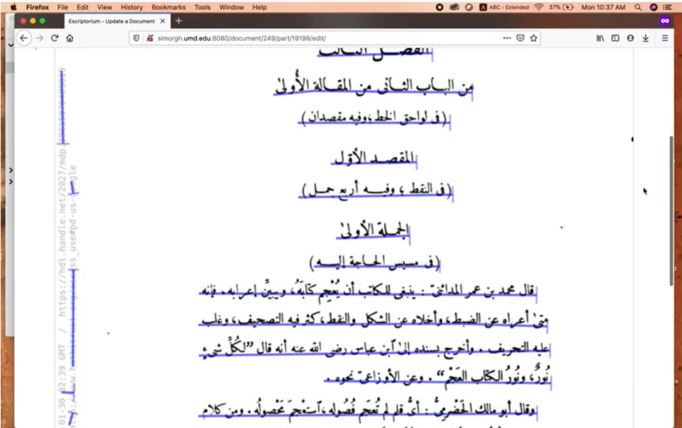

# Week 2: Corpus Construction and Modeling Digital Humanities Data 

***2/4/2021 Thursday***

Prepare for Class:

* Flanders, Julia and Fotis Jannidis. "Data Modeling in a Digital Humanities Context." In *The Shape of Data in the Digital Humanities: Modeling Texts and Text-based Resources*, edited by Julia Flanders and Fotis Jannidis, 3-25. New York: Routledge, 2019. [Course Google Drive]   
* Underwood, Ted. "Algorithmic Modeling: Or, Modeling Data We Do Not Yet Understand." In *The Shape of Data in the Digital Humanities: Modeling Texts and Text-based Resources*, edited by Julia Flanders and Fotis Jannidis, 250-263. New York: Routledge, 2019. [Course Google Drive] 
* Martin Weisser. “Understanding Corpus Design.” In *Practical Corpus Linguistics: An Introduction to Corpus‐Based Language Analysis*, edited by Martin Weisser, 29-42. London: Wiley (2015). [Course Google Drive] 
* Watch eScriptorium training video #1, “Introduction to eScriptorium.”:

{target="_blank"}

[https://www.youtube.com/watch?v=N0hSNC3YvD4](https://www.youtube.com/watch?v=N0hSNC3YvD4){target="_blank"}

In class:

* Weekly reading report.
* Collaboratory assignment on digital text production (bring your computers!).

## most recent OCR transcription model for eScriptorium

Download it [here](./2021IslamicateWorldCourse_files/arabPers-WithDiffTypefaces.mlmodel)