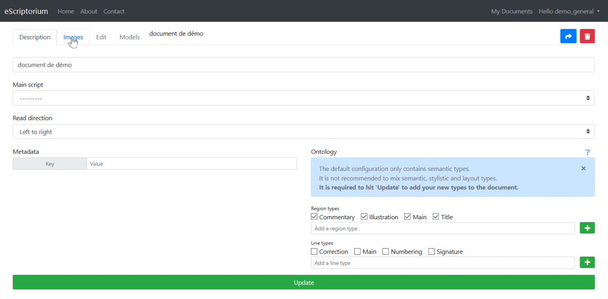
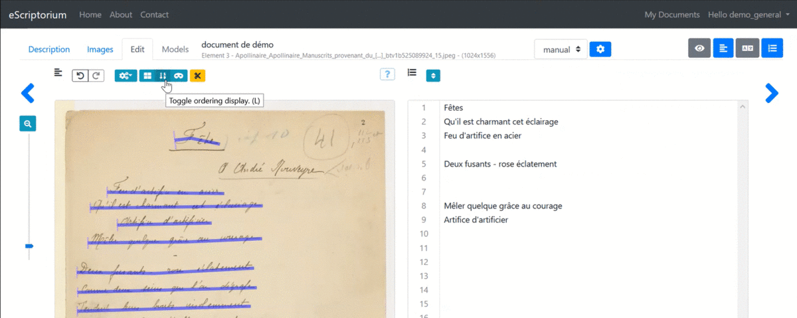

# Week 2: Corpus Construction and Modeling Digital Humanities Data 

***2/4/2021 Thursday***

Prepare for Class:

* Flanders, Julia and Fotis Jannidis. "Data Modeling in a Digital Humanities Context." In *The Shape of Data in the Digital Humanities: Modeling Texts and Text-based Resources*, edited by Julia Flanders and Fotis Jannidis, 3-25. New York: Routledge, 2019. [Course Google Drive]   
* Underwood, Ted. "Algorithmic Modeling: Or, Modeling Data We Do Not Yet Understand." In *The Shape of Data in the Digital Humanities: Modeling Texts and Text-based Resources*, edited by Julia Flanders and Fotis Jannidis, 250-263. New York: Routledge, 2019. [Course Google Drive] 
* Martin Weisser. “Understanding Corpus Design.” In *Practical Corpus Linguistics: An Introduction to Corpus‐Based Language Analysis*, edited by Martin Weisser, 29-42. London: Wiley (2015). [Course Google Drive] 
* Watch eScriptorium training video #1, “Introduction to eScriptorium.”:

{target="_blank"}

[https://www.youtube.com/watch?v=N0hSNC3YvD4](https://www.youtube.com/watch?v=N0hSNC3YvD4){target="_blank"}

In class:

* Weekly reading report.
* Collaboratory assignment on digital text production (bring your computers!).

## most recent OCR transcription model for eScriptorium

Download it [here](./2021IslamicateWorldCourse_files/arabPers-WithDiffTypefaces.mlmodel)

## where do I find eScriptorium? 

The UMD instance of eScriptorium can be found here: [http://simorgh.umd.edu:8080/](http://simorgh.umd.edu:8080/){target="_blank"}

## Getting started with eScriptorium 0.6.9

Tutorial written by [Alix Chague](https://escripta.hypotheses.org/440){target="_blank"}, and translated by Jonathan Allen.

### Additional Documentation:

-   Video demo of part of the eScriptorium features: [https://escripta.hypotheses.org/escriptorium-video-gallery](https://translate.google.com/website?sl=auto&tl=en&u=https://escripta.hypotheses.org/escriptorium-video-gallery){target="_blank"}

-   Source code of eScriptorium: [https://gitlab.inria.fr/scripta/escriptorium](https://translate.google.com/website?sl=auto&tl=en&u=https://gitlab.inria.fr/scripta/escriptorium){target="_blank"}

### Prerequisites:

-   Secure an account on an eScriptorium instance;

-   Or install a local instance of eScriptorium ( with Docker or without Docker ).

### Summary

-   1. Step by step

    -   1.1. Connection to eScriptorium

    -   1.2. Create a new document

        -   1.2.1. Point terminology

        -   1.2.2. Instructions

    -   1.3. Upload images

        -   1.3.1. Access the interface

        -   1.3.2. Import local files

        -   1.3.3. Import images from PDF file

        -   1.3.4. Use an IIIF manifesto

    -   1.4. Manually annotate documents

        -   1.4.1. Access the interface

        -   1.4.2. Annotate segments and areas on the image

        -   1.4.3. Annotate the transcript

        -   1.4.4. Aparté on the articulation of *baselines* , polygons
            and transcriptions

        -   1.4.5. Change the order of segments

        -   1.4.6. Semantic annotation

    -   1.5. Import annotations

        -   1.5.1. Import structured annotations in XML

        -   1.5.2. Import annotations from plain text

    -   1.6. Automatically annotate documents

        -   1.6.1. Instructions

        -   1.6.2. Setting up segmentation

    -   1.7. Train models

    -   1.8. Export data

-   2. Manage a collaborative annotation campaign

    -   2.1. Create a user group

    -   2.2. Share a document with another user or with a group

    -   2.3. Share a template with another user or with a group

### 1. Step by step

#### 1.1. Logging into eScriptorium

You log into eScriptorium with an individual account made up of a login,
a password and an email address. An account is created by the user after
receiving an invitation or by the site administrator:

{width="5.208333333333333in"
height="1.2777777777777777in"}

*Login form*

Once logged on, you will see the dashboard which allows you to manage
all the documents created by and shared with the account. On first
login, this dashboard is empty:

{width="5.208333333333333in"
height="1.8194444444444444in"}

#### 1.2. Create a new document

##### 1.2.1. Point terminology

-   A \"**document**\" is a collection of images forming a whole unit;

-   A \" **document-part**\" is an image\--a page belonging to a
    document.

##### 1.2.2. Instructions

To create a document, click on the "**Create new**" button; a new page
is displayed as well as an input form:

{width="5.208333333333333in"
height="2.486111111111111in"}

The document \"description\" tab is where you fill in the metadata.

The \"Name\" field is mandatory. The others are optional and can be
completed later. We will come back to the "Ontology" section later.

Once the information has been entered, click on "Create" to create the
document; a message is then displayed: "Document created successfully!\"
You can still modify the data entered: the \"Create\" button has been
replaced by an \"Update\" button.

{width="5.208333333333333in"
height="0.8194444444444444in"}

To return to this form from the dashboard, click on the "Edit" icon in
front of the document.

#### 1.3. Upload images

##### 1.3.1. Access the interface

The "Images" interface is used to manage most of the tasks related to
automatic image processing and imports and exports.

To access the image loading interface, click on the "Images" tab.

{width="6.5in" height="3.1944444444444446in"}

There are several ways to import images to the platform.

##### 1.3.2. Import local files

Simply load the files using drag-and-drop or click in the box to open
the file explorer. **Note:** you must wait until **all** the images are
loaded before refreshing the page!

{width="6.5in" height="4.083333333333333in"}

##### 1.3.3. Import images from PDF file

Click on the Import button, then Images (PDF) option to load a PDF file
and automatically extract the images. Please note, only the images are
imported. If the PDF contains a text layer corresponding to the
transcription, it is not imported.

{width="6.049451006124235in"
height="3.632784339457568in"}

##### 1.3.4. Use an IIIF manifesto

Click on the Import button, then the Images (IIIF) option, then enter
the url of an IIIF manifesto. All the images associated with the
manifesto are then copied locally, as well as the metadata, which is
visible in the "Description" tab.

Example:
[https://gallica.bnf.fr/iiif/ark:/12148/btv1b53026595r/manifest.json](https://gallica.bnf.fr/iiif/ark:/12148/btv1b53026595r/manifest.json){target="_blank"}

{width="6.5in" height="4.083333333333333in"}
*Demonstration of importing images through an IIIF manifesto.*

#### 1.4. Manually annotate documents

##### 1.4.1. Access the interface

Manual annotation is necessary to generate *ground truth data* used to
train models, or to correct the result of these operations. It can also
be used as part of an annotation campaign that does not make use of
Kraken models (eScriptorium only serves as an input environment).

The *document-parts* edit tab allows you to create or modify annotation
elements manually. It is accessed by clicking on the "Edit" tab at the
top of the page or by clicking on the "Edit" button on each "map"
representing a part-document. There are several viewing panes in this
tab corresponding to each possible editing task.

{width="5.208333333333333in"
height="1.7916666666666667in"}

{width="1.0416666666666667in"
height="1.4027777777777777in"}

Another way to access the \"Edit\" tab

-   \"Image source\" allows you to display the source image;

-   "Segmentation" displays the segmentation editing pane;

-   \"Transcription\" displays the editing pane of the transcription in
    diplomatic view;

-   \"Text\" is used to display the editing pane of the transcription in
    text mode.

{width="6.5in"
height="2.9027777777777777in"}

##### 1.4.2. Annotate segments and areas on the image

The segment editing pane allows you to perform several essential
operations:

-   Drawing *baselines* corresponding to the locations of the text on
    the image in two ways:

    -   Free route (not recommended);

    -   Point by point plot.

-   Adding points on a line (select it then double-click at the point\'s
    location);

-   Moving one or more point (s) by a simple select-drag;

-   Deleting one or more point (s) on a line;

-   Cutting one or more lines using the scissors tool;

-   Joining one or more lines;

-   Configuring the reading direction of a line;

-   Activating the calculation of the polygons associated with each line
    (this task is automatic and managed asynchronously without any
    action on the part of the user after the first use).

In this pane, it is also possible to create regions (or *zones* ) and
associate segments to them. A segment located within the perimeter of a
region is therefore not automatically associated with it.

All the operations that can be carried out in this pane are detailed in
a help window (to display it, click on \"?\"). It will thus be noted
that there are many shortcuts making it possible to simplify all these
operations.

##### 1.4.3. Annotate the transcript

Only when there are segments and masks on the image is it possible to
use the functionalities of the "Transcription" and "Text" tabs.

To add or modify a transcription associated with a segment from the
"Transcription" pane, click on the corresponding zone. An input window
is displayed. To record a transcription, press "Enter": the
transcription interface automatically displays the input field for the
next segment.

As you type in the "Transcription" pane, the crenellated areas are
replaced by text and the content of the "Text" pane changes. It is
therefore also possible to modify the text from the "Text" pane and even
to copy and paste several lines at once.

{width="6.5in" height="2.5833333333333335in"}

##### 1.4.4. A note on the articulation of baselines, polygons and transcriptions**

The *baseline* is the central element for storing information in the
eScriptorium database. So :

-   It is possible to modify a *baseline* (remove / move / add points)
    without impacting the transcription;

-   The polygon is always calculated from the *baseline*, including
    during training

-   It is possible to modify the polygon manually (not recommended)
    without this impacting the transcription.

{width="5.208333333333333in"
height="2.3194444444444446in"}

During the training of the Kraken models, the calculation of the
polygons is reset: the user therefore has an interest in not intervening
on the polygons and on the contrary to ensure that the *baselines* are
drawn in such a way that the automatically generated polygons are
correct. . Moreover, when manually entering ground truth data, care
should be taken to transcribe only what is inside the polygon.

##### 1.4.5. Changing the order of segments

The playback order of the segments is calculated automatically. You can
display the order number of each segment from the "Segmentation" pane by
clicking on "Toggle ordering display (L)" or from the "Text" pane where
the lines are displayed in the following order.

It is possible to modify this order from the "Text" pane by clicking
"Toggle sorting mode." A simple drag and drop of the lines is then
enough to carry out the modification.

**Note:** it is advisable to ensure the quality of the segmentation
before changing the order of the lines because adding or deleting lines
systematically restarts the calculation of this order, overwriting
manual modifications in the process.

{width="6.5in" height="2.5833333333333335in"}

##### 1.4.6. Semantic annotation

It is possible to associate labels (or *tags* ) with segments and
regions by following an ontology pre-defined by the user from the
"Description" tab. There are default *tags* , but it is possible to add
some using the input fields (click on \"+\" then \"Update\" to add the
new *tag* to the list) or to delete (uncheck the box in front of the
*tag* then click on \"Update\").

From the "Segmentation" pane, select an area or a segment, then click on
"Set the type on all selected lines / regions (T)" and choose the
appropriate *tag* . The color of the area or line changes.

It is possible to apply a *tag* to several regions or segments at once:
all you have to do is select several (Ctrl + click-drag or keep Ctrl
pressed and click the targeted segments / regions).

{width="6.5in" height="3.5in"}

#### 1.5. Import annotations

##### 1.5.1. Import structured annotations in XML

It is possible to import segments and / or a transcript generated
outside of eScriptorium. To do this, in the "Images" tab, click on the
"Import / Transcription (XML)" option.

A form appears allowing you to specify a name to identify the version to
import and to load the file to import. This can be an ALTO XML file, a
PAGE XML file or a ZIP containing several ALTO or PAGE XML files.

It is not necessary to select beforehand which document-parts are
concerned by the import: the link is made automatically according to the
information contained in the XML files.

{width="5.208333333333333in"
height="3.5694444444444446in"}

**Please note**, after importing segments generated without Kraken /
eScriptorium, it is essential to **reset the polygons ( *masks* )**
before using these documents to train a transcription model.

##### 1.5.2. Import annotations from plain text

It is possible to manually import a transcription from a plain text
version using the "Text" pane of the "Edit" tab. Each line break then
indicates the passage to a new segment. It is therefore necessary to
ensure that the reading order of the lines matches.

#### 1.6. Automatically annotate documents

##### 1.6.1. Instructions

Automatic document annotation is managed from the "Images" tab.

-   Select the images to annotate;

-   Click on "Segment" (for the detection of baselines, polygons and /
    or areas) or on "Transcribe" (for transcription);

-   A form is displayed: it allows you to load a Kraken model or to use
    a model already available in eScriptorium and, for segmentation, to
    configure the annotation.

##### 1.6.2. Setting up segmentation

-   \"Segmentation steps\" allows you to manage what level of
    segmentation is carried out:

    -   "Line and Regions" leads to the generation of zones (provided
        that the model used has been trained for this), baselines and
        associated polygons.

    -   "Line Baselines and Masks" leads to the generation of baselines
        and associated polygons.

    -   \"Only line Masks\" does not require loading a model; this
        option allows you to reset on the fly the calculation of the
        polygons associated with the baselines already present on the
        images.

    -   "Regions" makes it possible to keep intact the baselines and
        polygons already present on the images and to generate only the
        zones.

-   \"Text direction\" is used to indicate the reading direction of the
    lines.

{width="3.1944444444444446in" height="3.375in"}

#### 1.7. Train models

##### 1.7.1. Start a workout

Training of Kraken models is started from the "Images" tab; it is
tracked from the "Models" tab (inactive as long as no model other than
the default model is associated with the document).

Access to training functions may be subject to authorization. It is
managed from the administration interface.

To train a model, all the mobilized images / annotations must be in the
same document.

-   Select the share documents containing the ground truth;

-   Click on \"Train\" then select the type of model to train:
    \"Segment\" for a segmentation model, \"Recognizer\" for a
    transcription model;

-   Fill out the form then click on \"Train\";

-   The training task is started, sometimes you have to wait before this
    is displayed.

When the training is finished, the user receives a notification and can
access the final model from the "Models" tab. It is then possible to
download the model or use it on the document.

##### 1.7.2. Refine a model or start from scratch?

The training configuration form allows you to choose:

-   If you want to start from scratch (simply indicate the name to give
    to the new model that will be created);

-   Or if you want to refine a model (it can be loaded from the file
    manager, or be already present in the list of models associated with
    the current document).

**Caution:** in version 0.6.9, modifying the name of the model to train
is only taken into account in the case of a model starting from zero. In
order not to overwrite an already existing model, make sure to download
the model locally, rename it according to the name desired for the new
model, then load it into eScriptorium from the form.

#### 1.8. Export annotations

The export of annotations is carried out from the "Images" tab.

-   Select the relevant part-documents;

-   Click on \"Export\" then fill out the form:

    -   Specify the version of the transcription to export;

    -   Specify the export format (\"Alto\" for XML ALTO, \"Pagexml\"
        for XML PAGE, or \"Text\" for plain text);

    -   Check \"Include Images\" if you also want to export the images;

-   Click on Export and save the generated ZIP file.

### 2. Manage a collaborative annotation campaign

#### 2.1. Create a user group (admin)

It is possible to create user groups from the administrator\'s dashboard
(provided you have the associated rights). These groups are used to
define work teams or to assign certain rights to a set of users.

It will soon be possible for a user with sufficient rights to create a
team and invite other users to it.

#### 2.2. Share a document with another user or with a group

A user can share a document with multiple users, including outside of
the group (s) to which it belongs. From the \"Description\" tab:

-   Click on the \"Share\" button

-   Enter the name of the user with whom to share the document, or check
    his name in the list that appears

-   To confirm, click on \"Share\"

{width="6.5in" height="3.1944444444444446in"}

#### 2.3. Share a template with another user or with a group

A template is associated with a document and not with a user. To share a
model with another user, there are two possibilities:

-   Download the model from the "Models" tab and send the model via
    another exchange system (e-mails, etc.);

-   Share with the user the document to which the template is
    associated. It is then up to the other user to download the model
    and then load it into the document where he wishes to apply it.
