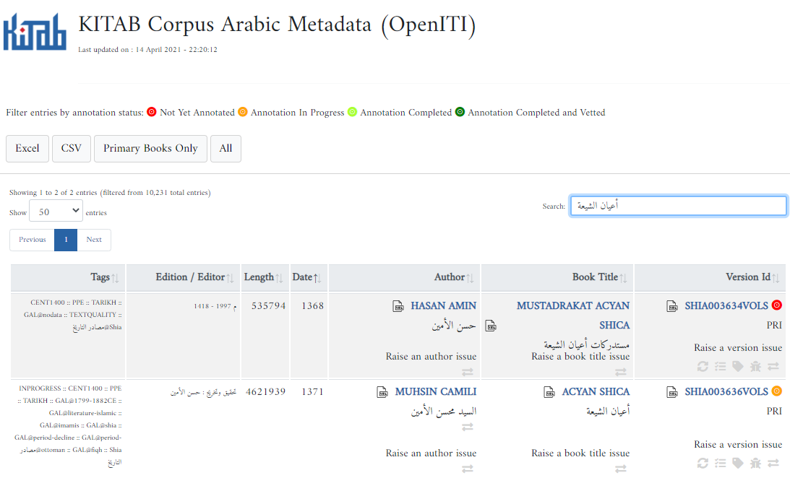

# week 6: Interacting with the OpenITI Corpus Using Github and Kate

***3/4/2021 Thursday***

Prepare for Class:

* **Install** some software we will need: 
    - Install Kate editor and the OpenITImARkdown highlighting scheme for Kate (instructions for Mac and Windows [here](#installing-kate-editor))
    
      NB: **Since our favourite editor EditPad Pro is not supported anymore on 
      the most recent Mac operation systems, we have decided to use another 
      free editor for use in the course that works for Mac, Windows and Linux users alike.**

      **So please install Kate, even if you are a Windows user and have already 
      installed EditPad Pro last week. This will make tutorials much easier...**
    - Install Git and Git Bash (instructions for Mac and Windows [here](#installing-git))
    - Create a GitHub account if you don't have it already: 
    go to [GitHub.com](https://www.github.com) and sign up for an account (it's free)
* **Complete** the very basic tutorial on using GitHub  [here](#working-with-github).
  
  **NB: to learn anything from a tutorial, you have to do all the steps yourself, not just read it!
  Also, type the commands yourself, do not simply copy them, you will learn much faster this way.**
* **Read** a couple of introductory articles that will give you some very basic 
     background on the tools we are going to use
    - Introduction to the command line: read the first four sections of this tutorial: [http://programminghistorian.org/lessons/intro-to-bash](http://programminghistorian.org/lessons/intro-to-bash)
    
       NB: (optional) A more detailed introduction (and useful list of commands) is available here:
       [https://learnpythonthehardway.org/book/appendixa.html](https://learnpythonthehardway.org/book/appendixa.html)
    - Very first introduction to using Github: [https://guides.github.com/activities/hello-world/](https://guides.github.com/activities/hello-world/)
    - Introduction to using Github from command line:
     [https://towardsdatascience.com/getting-started-with-git-and-github-6fcd0f2d4ac6](https://towardsdatascience.com/getting-started-with-git-and-github-6fcd0f2d4ac6)

In class:

* Introducing the OpenITI corpus
* Downloading OpenITI texts
* annotating texts using the OpenITI mARkdown scheme in Kate editor
* Using GitHub for cooperative project work

## Finding texts in the OpenITI corpus

The easiest way to find a text in the OpenITI corpus is to use the metadata 
application at [kitab-corpus-metadata.azurewebsites.net](https://kitab-corpus-metadata.azurewebsites.net/).

The search function of the app allows you to filter the books by 
the author's name or year of death, the work's title, 
a specific OpenITI version id, and/or tags. 

For some books, the OpenITI corpus contains multiple books. The "best" version
of each book is labeled `PRI` (for "primary") in the Version Id column. 

To download a single text file, right-click the Version Id
of the book (in the right-most column) and choose "save as". 
If you only need a link to the text file, right-click the version Id and 
choose "Copy link address". 

By clicking on a book's Version Id you can access the text on GitHub; 
clicking on the Book Title link will bring you to the folder on GitHub
where all text versions and metadata of the same book are stored, 
while clicking on the Author link will open the GitHub folder where
all works by that author are stored. 

More info: 

* [OpenITI FAQ - How can I find a text in OpenITI](https://openiti.github.io/documentation/#how-can-i-find-a-text-in-openiti)