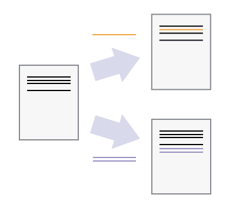
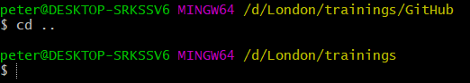
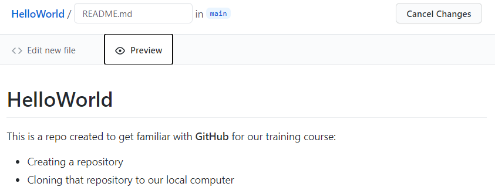

# week 6: Interacting with the OpenITI Corpus Using Github and Kate

***3/4/2021 Thursday***


Prepare for Class:

* **Install** some software we will need: 
    - Install Kate editor and the OpenITImARkdown highlighting scheme for Kate (instructions for Mac and Windows [below](#installing-kate-editor))
    
      NB: **Since our favourite editor EditPad Pro is not supported anymore on 
      the most recent Mac operation systems, we have decided to use another 
      free editor for use in the course that works for Mac, Windows and Linux users alike.**

      **So please install Kate, even if you are a Windows user and have already 
      installed EditPad Pro last week. This will make tutorials much easier...**
    - Install Git and Git Bash (instructions for Mac and Windows [below](#installing-git))
    - Create a GitHub account if you don't have it already: 
    go to [GitHub.com](https://www.github.com) and sign up for an account (it's free)
* **Complete** the very basic tutorial on using GitHub  [below](#working-with-github).
* **Read** a couple of introductory articles that will give you some very basic 
     background on the tools we are going to use
    - Introduction to the command line: read the first four sections of this tutorial: [http://programminghistorian.org/lessons/intro-to-bash](http://programminghistorian.org/lessons/intro-to-bash)
    
       NB: (optional) A more detailed introduction (and useful list of commands) is available here:
       [https://learnpythonthehardway.org/book/appendixa.html](https://learnpythonthehardway.org/book/appendixa.html)
    - Very first introduction to using Github: [https://guides.github.com/activities/hello-world/](https://guides.github.com/activities/hello-world/)
    - Introduction to using Github from command line:
     [https://towardsdatascience.com/getting-started-with-git-and-github-6fcd0f2d4ac6](https://towardsdatascience.com/getting-started-with-git-and-github-6fcd0f2d4ac6)


In class:

* Introducing the OpenITI corpus
* Downloading OpenITI texts
* annotating texts using the OpenITI mARkdown scheme in Kate editor
* Using GitHub for cooperative project work


## Installing Kate editor

### On Windows

* Download the most recent installation file here:   
  [https://binary-factory.kde.org/view/Windows%2064-bit/job/Kate_Release_win64/](https://binary-factory.kde.org/view/Windows%2064-bit/job/Kate_Release_win64/) ; 
  go to the **Pipeline Kate_Release_win64** section on that page and download the file that ends with `_64-cl.exe`.

* Once the file was downloaded, double-click the installation file and follow the instructions (you can keep all the default settings the installer proposes)
 
* Kate should now be installed on your computer. Proceed to install the OpenITImARkdown highlighting scheme (see below)


### on Mac

* Download the `.dmg` file here: 
  [https://binary-factory.kde.org/view/MacOS/job/Kate_Release_macos/](https://binary-factory.kde.org/view/MacOS/job/Kate_Release_macos/)
  (choose the file that ends with `.dmg`, the other file is a 
  [checksum](https://www.howtogeek.com/363735/what-is-a-checksum-and-why-should-you-care/))

* Once downloaded click on the .dmg file, double click on the “kate” icon or drag it to the Applications folder 

    NB: You will most likely get a message like 

    ```
    “kate” can’t be opened because Apple cannot check it for malicious software. 
    This software needs to be updated. Contact the developer for more information.
    ``` 

    This is because recent Mac instances do not allow you to install apps from non-verified developers. There is however a way to override this security measure:
    - Go to “system preferences” => “security & privacy” => under “general” you will see a note saying `"Kate" was blocked from use because it is not from an identified developer”
    - click “open anyway”
    - a new pop up will appear where you will have to consent again, and then the app should launch 
    
    The process is generally explained here (+ a shortcut if you’re feeling adventurous):
    
    https://mac-how-to.gadgethacks.com/how-to/open-third-party-apps-from-unidentified-developers-macos-0158095/  

* Kate should now be installed on your computer. Proceed to install the OpenITImARkdown highlighting scheme (see below).

## Installing the OpenITI mARkdown highlighting scheme for Kate

### On Windows: 

* Download the highlighting scheme `OpenITImARkdown.xml` file [here](./2021IslamicateWorldCourse_files/OpenITImARkdown.xml)

* In Windows Explorer, go to `C:/Users` and double-click the folder with your user name

* In your user folder, find the folder `AppData`. This folder is sometimes hidden; to make it visible, you may have to go to the "View" tab in Windows Explorer, and check the box next to "Hidden items": 


* Enter the `AppData` folder, double-click the `Local` folder, and make a new directory in it: `org.kde.syntax-highlighting`

* Within the new `org.kde.syntax-highlighting` folder, create another new folder: `syntax`. The full path to this folder should now be `C:\Users\<user_name>\AppData\Local\org.kde.syntax-highlighting\syntax`

* Copy the `OpenITImARkdown.xml` file into the newly created `syntac` folder. 

* Close the Kate editor if it was open, and open it again. 

* You should now be able to find the OpenITImARkdown highlighting scheme in the list in the Tools > Highlighting > Markup menu: 


And also in the dropdown menu in the bottom right of your Kate screen: 


### On Mac: 

(Thanks to John for figuring this out!)

1. Download the highlighting scheme `OpenITImARkdown.xml` file [here](./2021IslamicateWorldCourse_files/OpenITImARkdown.xml)
2. Open Finder
3. in the Finder menu, choose Go > Go to folder..., write `~/Library/Application Support/`, then click `Go`
4. create a new folder using the combination command+shift+n, and call it `org.kde.syntax-highlighting`
5. Move into that folder, and create another subfolder using command+shift+n, called `syntax`
6. Copy the `OpenITImARkdown.xml` file into that folder
7. Close the Kate editor if it was open, and open it again. 

You should now be able to find the OpenITImARkdown highlighting scheme in the list in the Tools > Highlighting > Markup menu: 


And also in the dropdown menu in the bottom right of your Kate screen: 


## Working with GitHub

GitHub is primarily a software development platform but it can be used for other
projects that require intensive cooperation and/or version control as well.

It uses the distributed version-control system Git
([https://en.wikipedia.org/wiki/Git](https://en.wikipedia.org/wiki/Git))
for keeping track of changes to files on each of the different
developers' machines. GitHub also offers additional features that
facilitate collaboration within the core team, collaboration with
outside contributors and interaction with users.

### Why use a version control system?

(adapted from
[https://swcarpentry.github.io/git-novice/01-basics/index.html](https://swcarpentry.github.io/git-novice/01-basics/index.html)
)


Even if working alone, you quickly run into multiple versions of the
same document. This problem is compounded when working in a team.

Version control systems start with a base version of the document and
then record changes you make each step of the way. You can think of it
as a recording of your progress: you can rewind to start at the base
document and play back each change you made, eventually arriving at your
more recent version.


Once you think of changes as separate from the document itself, you can
then think about "playing back" different sets of changes on the base
document, ultimately resulting in different versions of that document.
For example, two users can make independent sets of changes on the same
document.



Unless multiple users make changes to the same section of the document -
a conflict - you can incorporate two sets of changes into the same base
document.


A version control system is a tool that keeps track of these changes for
us, effectively creating different versions of our files. It allows us
to decide which changes will be made to the next version (each record of
these changes is called a commit), and keeps useful metadata about them.
The complete history of commits for a particular project and their
metadata make up a repository. Repositories can be kept in sync across
different computers, facilitating collaboration among different people.

GitHub uses the version-control system Git
([https://en.wikipedia.org/wiki/Git](https://en.wikipedia.org/wiki/Git)).
Git is called a "distributed" version-control system because the change
history of a repository is maintained not only on a central server, but
also in each copy of the repository (we will see later that these changes
are located in a folder called `.git` at the root of the repository).

### Installing Git

#### On Windows

(instructions from
[https://www.pluralsight.com/guides/using-git-and-github-on-windows](https://www.pluralsight.com/guides/using-git-and-github-on-windows))

Download Git for windows here:
[https://gitforwindows.org/](https://gitforwindows.org/)

Execute the downloaded file. A few notes on the options you will be given during the installation process:

* In the page Select Components you can leave
the options at their defaults.

* The Windows Explorer integration \> Context menu entries option allows
opening the Git command prompt (Git Bash) from any folder by clicking
with the right mouse button on the folder and selecting Git Bash Here.
The last option is also interesting in that it installs a better font
for all console windows.

* On the next screen (Adjusting your path environment), choose the most
conservative option: Use Git Bash only. This will make git commands
available only in Git Bash and will not alter your PATH variable. Click
Next.

* Another important setting: line endings. As you may know, Windows and
Unix systems (Linux, Mac) have different formats of line breaks on text
files. If you write a file with Windows line breaks, another person may
have problems opening that file in Linux and vice-versa. The line
endings setting allows you to normalize this. Choosing the second option
(Checkout as-is, commit Unix-style line endings), that won\'t change the
line breaks when the file arrives but will convert them to Unix-style
when you commit. That way, you don\'t risk committing Windows-style line
breaks and everything is kept in Unix-style. Don\'t worry, even though
you are in Windows, most of the text editors can read Unix line breaks
just fine.

* After that one more Next, Finish, and Git is installed!

##### On Mac

(instructions from
[https://www.atlassian.com/git/tutorials/install-git](https://www.atlassian.com/git/tutorials/install-git))

Download Git for Mac here:
[https://sourceforge.net/projects/git-osx-installer/files/](https://sourceforge.net/projects/git-osx-installer/files/)

Follow the prompts to install Git.

##### On Linux

(instructions from
[https://www.atlassian.com/git/tutorials/install-git\#linux](https://www.atlassian.com/git/tutorials/install-git#linux))

From your shell, install Git using apt-get:

```
$ sudo apt-get update
$ sudo apt-get install git
```

### Introducing your main git tool: Git Bash

#### On Windows

We interact with Git through a program called Git Bash, which was
installed together with Git in the step above. Git Bash is a command
line program, which means you interact with it not by clicking buttons
with your mouse but by writing commands. Only the thought of this may
repulse many humanities scholars, but fear not: it is easy to learn, and
we need only very few commands.

To open Git Bash, right-click on a folder in Windows Explorer, and
choose "Git Bash here"


This will open the program:


#### On Mac

If you are a Mac user, you are probably familiar with the standard Mac
command line tool, Terminal. You can use Terminal to interact with Git,
or install a dedicated command line tool for Git, called Git Bash:

* To open Terminal, do one of the following:

    - Click the Launchpad icon
      in the Dock, type "Terminal" in the
     search field, then click "Terminal".

    - In the Finder , open the `/Applications/Utilities`
     folder, then double-click "Terminal".

* To install Git Bash: download it from here:
[https://downloads.digitaltrends.com/git/mac](https://downloads.digitaltrends.com/git/mac)

#### On Linux

If you're using Linux, you don't have to download the Git Bash program;
you can use the normal shell to interact with Git. You can use all
normal Linux commands (`cd`, `ls`, ...), in addition to a number of
additional git commands that will be explained below.

### Absolute minimum knowledge of command line commands

Open the command line program which you are going to use for interacting with GitHub
(Git Bash, Terminal, Linux shell: for instructions, see 
[previous](#introducing-your-main-git-tool-git-bash) section). 
In this tutorial, we will be using Git Bash. 


"d/London/trainings/GitHub" shows the location of our working directory,
where we opened the program; the dollar sign indicates that we can write
a command, and it will be executed in our working directory.

NB: In this tutorial, we will include the dollar sign before every
line that should be executed in Git Bash; you don't have to write it in
Git Bash when copying commands from this document. 

In order to execute a command, press the "Enter" key.

Important commands:

-   `cd` (for "change directory"):

    -   move to another folder by writing the path to it (which is the
         chain of folders that connects that folder to your current
         working directory):
         
         ```
         $ cd path/to/my/folder
         ```
         
         In the example above, the path is `d:/London/trainings/GitHub`. 
         To move to that folder from anywhere on your computer, 
         use the following command and press enter to execute it:
         
         ```
         $ cd d:/London/trainings/GitHub
         ```

    -   To move to the parent folder (which is the folder above your
         current working directory): use the command `cd ..`
         
         
    

-   `ls` (for "list"): list all files and folders in a directory (folder).

    -   List all files and folders in the current working directory:
    
         ```
         $ ls
         ```
         
         

    -   List all files and folders in another directory:
    
         ```
         $ ls path/to/my/folder 
         ```
         
         
         
NB: a useful tip: You can use the tab key to speed up typing paths in a command 
line program. After typing one or two letters, hit tab, and the program will try
to complete the folder/file name you had started to type (based on all the 
folder/file names in the current folder). For example, for going to the folder 
`d:/London/trainings/GitHub` on my machine, I could type: 
"d:/Lon", and hit TAB; since there is no other folder that starts with "Lon" on
my D: drive, it will autocomplete to "d:/London". If I'm not sure which folder
the `GitHub` folder is in, I could then hit enter and type `ls`, which would show me
all folders inside the d:/London folder. I would recognize `trainings` as the one
I put my `GitHub` folder is in, so I could type "tr" followed by TAB, followed by
"Gi", and another TAB, to get to my final destination.


### Essential GitHub commands

We will be covering the following commands during this tutorial: 

```
git clone
git status
git add
git commit
git push
```

These few commands will be enough to do most of your work on GitHub. 
That's not too bad, is it?

### Creating your first GitHub repository

A repository is a folder that contains a git project. You will create a repository
for each project you are starting. 

Go to GitHub.com. 

**If you don't have a GitHub account yet, create one now by 
clicking the `sign up` button and go through the  sign up process.
To finalize the process, you have to click a link sent to the email address
you used to set up the GitHub account**

Log in to your account by clicking the `Sign in` button in the top right of the window. 

Once you're signed in, you'll see an automatically created personal avatar in 
the top right of the window;if you click on it,
you'll see your user name and a couple of links: 


Create a project by clicking the plus sign next to your avatar, and selecting 
"New repository" from the dropdown list: 


Give your repository a new name. It is a tradition in computer programming to 
call your first project "Hello World". GitHub does not allow spaces in repository
names, so let's call ours "HelloWorld". Also add a short description. 


GitHub gives you a couple of additional options: the repository can be either 
public (meaning, anyone on the internet can see it, but you can decide who
can make changes to it) or private (meaning it is invisible, but you can 
invite specific people to view your repo and participate in it). 

GitHub also offers you to create your repository with some files included from 
the start: a README file explaining what this project is about, a .gitignore file
(which describes which files should never be copied when downloading and uploading
to GitHub - more on this later), and a license (which describes how people can
use your project - copyright-wise). 

Let's create the repository without any of these files, and click the green 
"Create Repository" button.

When the repository is created, you arrive at a landing page, which explains 
very shortly what the next steps could be: 

* manually create a new file in the repository
* upload an existing file to the repository
* connect your new repository to a folder on your local computer
* use the command line to add data from an existing folder on your local machine
    to this git repository
* import code from another repository    

We'll use the first option and create a README file: click the "creating a new file"
link in the "Quick setup" section of the landing page:


Give a name to the file: we'll call it `README.md`:


NB: `.md` is the extension for markdown files. 
Markdown is a lightweight markup language that allows you to format a text with 
title headings, bold, italics, etc. using a small amount of special characters. 
See a cheatsheet with an overview of the syntax elements here: 
[https://www.markdownguide.org/cheat-sheet/](https://www.markdownguide.org/cheat-sheet/).

It is a very useful format for writing things for the internet - this tutorial 
was also written in markdown.

Let's write some markdown text in the README.md file:


If you click the Preview button, you can see the effect of the special characters
`#` (first-level header), `**...**` (bold) and `*` (unordered list) is: 



At the bottom of the page (you may have to scroll down) you will find a message
box titled "Commit new file". `Commit` is an important git command: every change
you make in a git repository will be saved with a short descriptive title ("commit message") 
for later reference, so that other users (or yourself) can go through the history
of changes and roll back changes if necessary. 

The commit message is usually a very short message (about 50 characters), 
in the imperative form. You can write it in the smallest of the two input fields.
You will see that GitHub has already provided you with a proposal for your first
commit message: "Create README.md"
You can also add a more extensive description in the larger input field; this
is optional. 


In order to save our changes, we have to click the green "Commit new file" button.

That's it, you have created your first GitHub repository with your first README file, 
and you made your first commit!

If you want to edit the `README.MD` file, you can click the pencil icon:


Don't forget to write a new commit message and click the `Commit new file` button
if you have edited the text of the README file!

You can see the history of our commits by clicking the `History` button under
the green "Code" button:


This will show you all changes (commits) in the repository, from newest to oldest:


### Cloning: downloading a GitHub repository

Now that we have created our first GitHub repository, let's download it to our
personal computer, and make some more changes there. The process of downloading
a repository from GitHub on your local computer is called "cloning".

Go to the page of the repository you want to clone on GitHub, and click the 
green `Code` button. This will open a dropdown, which contains - among other 
things - a download link (usually, it will be the address of the GitHub page,
with a ".git" extension appended to it). Click the clipboard icon next to that
link to copy the link to your clipboard. 

Open the command line program you use for git (Git Bash, Terminal, Linux shell)
and navigate to the folder where you want to save a copy of our HelloWorld repo: 
`cd path/to/my/folder`


Write the following command: `git clone ` and paste the link from the clipboard,
and hit enter. In the case of the repo we created in the previous section, this 
would be 

```
$ git clone https://github.com/OpenITI-Training/HelloWorld.git
```

NB: in Git Bash on Windows, you cannot use the normal shortcut for pasting 
(`ctrl+v`); use `shift+insert` (or right-click, and choose `Paste`) instead.

The program will print a number of lines to the screen, detailing its progress: 


Congratulations, you cloned your first repository!

Let's navigate into the folder, and let's see what is in there. Use the command 
`cd HelloWorld` to move into the `HelloWorld` folder, and then write the command
`ls -la` to list all files in that folder (you already know the `ls` command;
the characters `la` at the end are so-called "flags" that change the behaviour
of the command: `-l` tells the program to list some details about each element
in the folder, and `-a` to include all files, including those that start with `.`).


The last item is probably the only one you expected: the README.md file we 
created on the GitHub page. The first two items in the list refer to the 
current folder (`.`), and its parent folder, that is, the folder that contains
the current folder (`..`, remember the `cd ..` command).

The most important item in the list is the `.git` folder; this folder contains 
the entire history of the repository. 

### Save your changes: add and commit

Now that we have cloned our GitHub repository, we can work with it: add new 
files and folders, make changes to existing files or delete them altogether.

Whenever you have made a change to a file in your local repo, you have
to notify Git that you did so. It is the Git equivalent of using "save
as". Git stores changes you made in files known as "commits"; each
commit has a unique id number, and a label ("commit message") that
describes in about 50 characters what changed to the repository when
this commit was made. This allows a user to go back in the history of
the repository, for example to return to earlier versions of a file.

1.  Make a change in the README.md file, using Kate editor. Make sure to save
     and close the file after you finished changing it.
     
     You can open Windows Explorer in the current directory from Git Bash 
     using the following command:
     
     ```
     $ explorer .
     ```
     
     On Mac, use `open .` instead.

2.  In Git Bash on your computer, use the `cd` command to move into your
     local repository:
     
     ```
     $ cd D:/London/trainings/HelloWorld
     ```

3.  You can use the command `git status` to make Git check which files
     in your local repository have undergone changes:
     
     ```
     $ git status
     ```
     
     If no changes occurred, you will get the following message: 
     
     ```
     On branch master
     Your branch is up to date with \'origin/master\'.
     nothing to commit, working tree clean
     ```

     If you have made changes, Git will return a list of the files that have 
     been changed (or added):

     
     
     For this example, we have changed the README.md file. Git displays it in 
     red to show that the changes to this file have not yet been stored in Git.


4.  We will now commit our changes to git, which will save them in the `.git` 
     folder on our computer. 
     A commit is like a box in which changes are saved. First you have to
     add the changes to the box using the "git add" command, followed
     by the path to the files you changed. 
     
     ```
     $ git add README.md
     ```

5.  If you use the "git status" command again, you will see that the
     file we changed is now displayed in green: the changes are in the
     commit box, ready to be committed to the storage system.
     
     

6.  Using the command `git commit`, we will commit our changes to the
     storage system. For later reference, we have to add a "commit
     message": a label to the commit box, so to say, that should help other
     users to understand the changes you made to the file without
     having to compare both files.
     The commit message should be introduced with the flag `-m` (for "message"), 
     and be placed between (single or double) quotation marks:
     
     
     
     This is equivalent to hitting the green `Commit` button on the GitHub website
     
     NB: a good commit message should be around 50 characters long, be
     descriptive, and in the imperative mood: the idea is that when you
     go through the history of changes made to a repo from the start,
     you can read the commit message as "when you execute this commit,
     Git will..."

7.  Your changes have now been included in the change history. You can
     view the change history with the command `git log`:
     
     ```
     $ git log
     ```
     
     

     This gives you a list of all changes (commits) made to the repository,
     from the most recent to the oldest.
     As you can see, every commit has a unique 40-character ID that can be used
     to go back to the state of the repository when this commit was made. The 
     log also lists the author and date of every commit, plus its commit message.
     
     NB: if the number of commits exceeds the Git Bash window, the log will open 
     in an editor within Git Bash. 
     You can use the `UP` and `DOWN` arrows on your keyboard to
     navigate through this history.
     To quit the log, type "q" after the colon at the bottom of the
     window.
     

### Publish your changes: push changes

Now you have committed your changes in your local Git repo, but if you
go to your personal GitHub page, you will see that the changes you made
in your local repository are not present there. 


The online repository on your GitHub page (your "remote" repository in Git-speak)
is not automatically updated when you add and commit to your "local" repo.

In order to update the remote repository, we will have to "push" our
changes to GitHub. 

1.  In Git Bash on your computer, use the cd command to move into your
     local repository if you were not in it already:
     
     ```
     $ cd D:/London/trainings/GitHub/HelloWorld
     ```

2.  Use the command `git push origin main` to push your changes to
     your fork on your personal GitHub page:
     
     ```
     $ git push origin main
     ```
     
     NB: `origin` is the default name for any remote repository you clone on your computer; 
     `main` is the default name of main branch within that repository. 
     So, this command means "push the changes on the active branch of this repo 
     on my local computer to the `main` branch of the remote repository 
     it was cloned from (`remote`)". You can see the name of the main branch
     of a repository in Git Bash: 
     
     
     
     Branches are an important concept in Git (see 
     [here](https://docs.github.com/en/free-pro-team@latest/github/collaborating-with-issues-and-pull-requests/about-branches)
     if you want to learn more), but are outside the scope of this tutorial.
     
     NB: `main` has become the default name for the main branch of a repository
     on GitHub only recently; in repositories created before October 2020, 
     the default name was `master`. This change is the result of a 
     [backlash](https://www.allaboutcircuits.com/news/how-master-slave-terminology-reexamined-in-electrical-engineering/)
     against the use of words with slavery connotations in computer science and 
     engineering.

3.  If we go to our personal GitHub page now, we will see that our
     changes are now also visible in our remote repository. Our commit
     message is displayed at the top.
     


