# week 8: Introducing R (in GUI) through Stylo(metry)

***3/25/2021 Thursday***

Prepare for Class:

* Install software (instructions below): 
  - [R](#installing-r)
  - [RStudio](#installing-rstudio)
  - [the `stylo` package and its dependencies](#installing-stylo-and-its-dependencies)
* Read the following articles: 
  - Holmes, David I. “The Evolution of Stylometry in Humanities Scholarship.” 
  *Literary & Linguistic Computing* 13, no. 3 (1998): 111-117.  
  [Course Google Drive]
  - Koppel, M., Schler, J. and Argamon, S. “Computational Methods in Authorship 
  Attribution.” *Journal of the American Society for Information Science and 
  Technology* 60, no. 1 (2009): 9-26. [Course Google Drive]     
  - Eder, Maciej, Jan Rybicki, and Mike Kestemont. “Stylometry with R — A Package 
  for Computational Text Analysis.” The R Journal Vol. 8/1 (2016). 
  [Course Google Drive]    
* Optional reading (extra credit for UMD students): 
  - Sadeghi, Behnam. “The Chronology of the Qur’ān: A Stylometric Research 
  Program.” *Arabica* 58.3–4 (2011): 210-99. [Course Google Drive]

In class:

* Weekly reading report.
* Collaboratory assignment with ‘Stylo’ R Package (bring your computers!).


## Installing R 

`R` is a programming language that is often used for data analysis.
It contains powerful and easy-to-use tools for statistical analysis and
creating graphs. 

The next weeks, we will provide an introduction to programming with `R`,
geared at absolute beginners, and provide multiple usage examples for 
digital humanists. 

Installing `R` is quite straightforward. We will install it from CRAN 
(The Comprehensive R Archive Network).

### On Mac
1. Download the latest R version: go to 
[cran.r-project.org/bin/macosx/](https://cran.r-project.org/bin/macosx/) 
and click on the `R-4.0.4.pkg` link to download `R` (the version number may be 
different; the website will always bring you to the link for the latest version)
2. click on the downloaded file to start the installation process. You can stick 
with the defaults, so click every `Next` button until you reach the end of the 
installation process. 


### On Windows
1. Go to [https://cran.r-project.org/](https://cran.r-project.org/), and click on "Download R for Windows"
2. Click "base"
3. Click "Download R 4.0.4 for Windows" (the version number may be different; the
website will always bring you to the link for the latest version)
4. Double-click the `R-4.0.4-win.exe` file (again, the version number may be different)
to start the installation process. You can stick with the defaults, so click
every `Next` button until you reach the end of the installation process. 


## Installing RStudio

RStudio is a working environment (IDE, *Integrated Development Environment*) 
for R that allows you to write R code and execute it. 

You can write `R` scripts in any text editor and execute them from any
command line program, but an IDE like RStudio makes writing and executing
`R` code much easier. 

**IMPORTANT: install RStudio only after you have installed R**

### On Mac
1. Go to [https://rstudio.com/products/rstudio/download/#download](https://rstudio.com/products/rstudio/download/#download)
2. Click the `DOWNLOAD RSTUDIO FOR MAC OS` button. If this button does not appear 
for some reason, click the download link for the macOS 10 version `.dmg file` 
in the table below: 


3. Click the downloaded `RStudio-1.4.1106.dmg` file (NB: the version number may 
be different; the website will always bring you to the link for the latest version)
to start the installation process. You can stick with the defaults, so click
every `Next` button until you reach the end of the installation process.

### On Windows

1. Go to [https://rstudio.com/products/rstudio/download/#download](https://rstudio.com/products/rstudio/download/#download)
2. Click the `DOWNLOAD RSTUDIO FOR WINDOWS` button: 

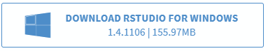
If this button does not appear for some reason, click the download link for the
Windows 10/8 version `.exe file` in the table below: 


3. Double-click the downloaded `RStudio-1.4.1106.exe` file (NB: the version number may be 
different; the website will always bring you to the link for the latest version)
to start the installation process. You can stick with the defaults, so click
every `Next` button until you reach the end of the installation process.


## The RStudio interface

1. Open RStudio
* in Windows: click the `Start` button at the bottom left of your screen, type
"RStudio" and click on the RStudio App button that appears: 
* on Mac: click RStudio in your `Applications` screen


2. The interface should look more or less like this: 

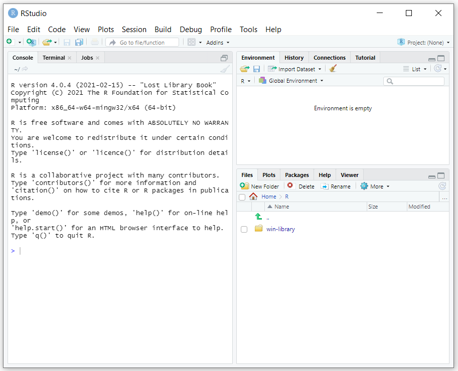

The interface contains three *panes*:

* On the left, you will find the **Console pane** , which allows you to write and
execute code interactively, just like in a command-line program. 
Note that the prompt in RStudio looks like `>`, not like `$`.
* On the top right, you will find the **Environment pane**, which will show you
the `R` objects in your current project, and a history of the most recent commands
you executed in the console pane. 
* On the bottom right, you will find the **Files pane**, where you can select 
files to open with RStudio. This pane also contains tabs for displaying graphs
you create in RStudio, Help information for using R and different packages 
(i.e., extensions of the `R` language), etc.

You can mimimize and maximize each pane using the `minimize` and `maximize` buttons
in each pane: 

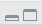

The console pane allows you to write code interactively: after every line you 
write, `R` will execute (`run`) that line once you hit the `Enter` key. 

Sometimes it may be useful to write multiple commands and then execute these 
at once. Such a series of commands is called a **script** and is saved in a
text file with the extension `.r` (e.g., `hello_world.r`). One of the main advantages
of saving your commands in a script is that you can re-run the same series of 
commands whenever you wish. 

You can write a script in any text editor; but RStudio also contains a script 
editor that offers additional functionalities: an autocomplete function,
a button for executing your script, a debugger to help you find mistakes in
your scripts, etc. 

In order to start writing a script in RStudio, choose `File > New File > R Script` 
in the menu (or use the `Ctrl+Shift+N` shortcut):


This will open up a fourth pane in the RStudio window, called the **source pane**:


## Installing stylo and its dependencies

Like many programming languages, the core development team of `R` focuses on the 
main functionality of the language. Users can add functionalities that they find
useful themselves, and can share these with all users of the `R` language.
These extensions to the main functionality of `R` are called **packages**,
and can be downloaded from a central repository of packages: 
[cran.r-project.org/web/packages/](https://cran.r-project.org/web/packages/). 
The CRAN package repository contains 17.351 packages at the time of writing 
(March 2021). 

Examples of such packages are `ggplot2`, for creating advanced graphs, and 
`stylo`, the stylometric package we are going to introduce currently. 

Some of these packages build upon other packages, and require these are installed
first. For example, in order to install the `stylo` package, we will have to 
install a number of packages first; these are referred to as `stylo`'s 
**"dependencies"**: 

* ape
* tcltk2

1. Open RStudio
* in Windows: click the `Start` button at the bottom left of your screen, type
"RStudio" and click on the RStudio App button that appears: 
* on Mac: click RStudio in your `Applications` screen


2. Packages in R are installed using the `install.package` command. We will start
by installing `styolo`'s first dependency: `ape` (a package for creating 
[phylogenetic trees](https://en.wikipedia.org/wiki/Phylogenetic_tree), 
that is, diagrams showing evolutionary relationships between entities)

In RStudio's console pane, write the following command and hit `Enter`:

```
> install.packages("ape")
```

A few remarks: 

* the `>` in the command symbolizes the prompt; you do not have to type it, 
it is only there to show that you have to type the command in an interactive 
prompt. 

* You may receive a warning that `RTools is required to build R packages but is
not currently installed`. You can safely ignore this warning for now, the 
package will be installed anyway. 

* If you start typing the name of the package (without the quotes), RStudio will
  show you a list of available packages; you can select the one you need by 
  clicking it in the list: 

  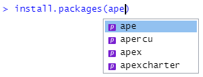

  If you do so, RStudio will autocomplete the command: 

  ```
  > install.packages("ape")
  ```

  Hit `Enter` to execute the command and install the package.

  NB: Note that as part of the autocomplete process, RStudio added the quotes. 
  If you type the full name of the package without quotes, and hit `Enter`, 
  RStudio will throw an error: 

  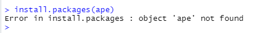


3. Repeat step 2 for the package `tcltk2` (which contains additional graphical
elements ("widgets") for building graphical interfaces): 

```
> install.packages("tcltk2")
```

4. Finally, repeat step 2 for the package `stylo` itself:

```
> install.packages("stylo")
```

NB: to get a list of all installable packages, run the command `install.packages()`
without anything between the brackets. 

## First steps with the `Stylo` package

`stylo` is a package for stylometry, created by Maciej Eder (this is how you 
pronounce his first name: 
[pronouncenames.com/pronounce/maciej](https://www.pronouncenames.com/pronounce/maciej)). 

For a description of the package, see Eder's article "Stylometry with R: A Package
for Computational Text Analysis" in the Google Drive reader, and for more on
stylometry, see the article by Holmes. 

### Setting up a stylo project

Every stylo project needs to be located in a separate folder. The texts you
want to analyse in the project need to be in a subfolder you name "corpus".

1. Create a folder for your first stylo project (e.g., 
`Home/course_projects/stylo_intro`); we are going to call this folder the 
"project folder" during this tutorial. 
You can create the folder using your favourite command line program, or
using your system's file manager (Explorer on Windows, Finder on Mac), but we
will create the folders using RStudio: in the Files pane (bottom right) 
click the `Home` button, and then `New Folder`.
Type "course_projects" in the popup that appears: 

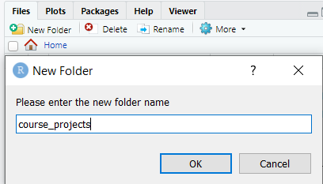

Find the new folder in the list of files and folders in the Files pane, and click
it. Then hit the `New Folder` button again to create a new folder inside the 
`course_projects` folder, and type "stylo_intro" in the popup that appears. 

Click the new `stylo_intro` folder to enter it. 

2. Using the same method, create a new folder within the project folder
(`Home/course_projects/stylo_intro`), and call it "corpus". If you move into
that folder, the full path to that folder should now be displayed in the File pane:

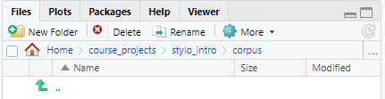

3. Add your first texts into the corpus folder. To use texts with `stylo`, they must
have a specific format: 

* the texts should be **all** in plain text format (or all in html or xml)
* the text files should be **all** in the same encoding (preferably UTF-8 if you 
have text in Arabic script (Arabic, Persian, Urdu, ...))
* file names: 
  - keep file names short, because they will be used in visualizations
  - use very consistent filename format
  - Metadata about the texts can be encoded in the filenames; divide metadata 
    categories by underscore. 
    For example, if you want to be able to display the titles and author names 
    of the books in the corpus, file names could have the following format: 
    `author_title.txt` (without spaces), 
    e.g., "Cervantes_DonQuixote.txt", "Tabari_Tarikh.txt", ...
  - `stylo` will classify the texts in its output using the first part of the 
    file name (the part before the first underscore). 
    * If you are interested in authorship attribution, put the author's name in 
      the first part of the file name (e.g., "Cervantes_DonQuixote.txt", 
      "Tabari_Tarikh.txt"); 
    * if you're interested in genre, put the genre in the first place: e.g., 
      `trag_Shakespeare_Hamlet.txt`, `com_Shakespeare_Taming.txt`
    * if you're trying to see differences between texts written by men and women, 
      put a gender marker in the first part (e.g., "f_JaneAusten_Sense.txt", 
      "m_WalterScott_Ivanhoe.txt")

Add at least two text files to the folder to perform your first stylo analysis.


### Open the stylo GUI

The `stylo` package contains a graphical user interface (GUI) to make stylometric
analysis with `R` easier for beginners. 

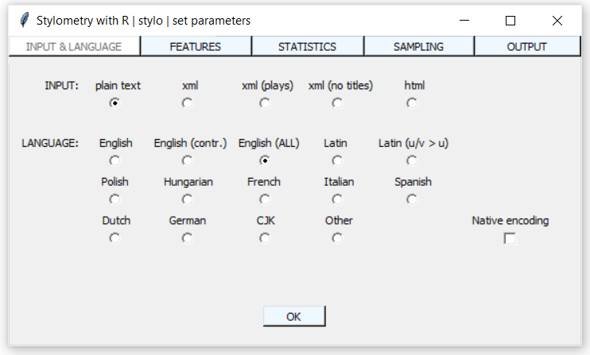

We will still need RStudio to open this graphical interface. Follow the next 
steps to open the GUI: 

1. In RStudio's console pane, set your working directory to the folder you 
created for this project (e.g., `Home/course_projects/stylo_intro`). 
`R` uses the command `setwd` (*set working directory*) for this task:  

```
> setwd("~/course_projects/stylo_intro")
```

A few remarks: 

* In the example script, we use the tilda (`~`) as the symbol for the `Home` 
directory of your computer. This symbol works in `R` on Windows, Mac and Linux. 
On Windows, it refers to the `Documents` folder.
* The brackets after `setwd` indicate that `setwd` is a **function** that `R` needs
to execute. A function is a sequence of commands that is given a name (in this
case, `setwd`). Between the brackets of a function, 
you can add a number of inputs, called **arguments**; each function has specific
types of arguments it needs to be able to run (you can see these by typing 
`help("package_name")` in RStudio: e.g., `help("setwd")`). `setwd` requires one 
argument, a string of characters that represents the path to the working directory.
* You can get your current working directory by using the command
`getwd` (*get working directory*). This is also a function
* In Windows, backslashes (`\`) are usually used for deliminating folders in a
path. For example, if you click the file path bar in Windows Explorer, the 
path to the file will become visible, and you can copy it: 

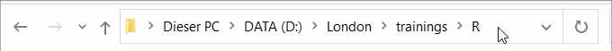

Pasting a path that contains backslashes between the brackets of `setwd()` 
will create problems, because `R` will interpret the backslashes as special
characters that lend a special value to the following character. 

If you still would like to paste a path with backslashes, you have to use a
workaround. The easiest way is to use the `readline()` function to deal with
the backslash characters (`readline()` will open an input field on the line 
below the command in which you can paste your path): 

```
> setwd(readline())
```

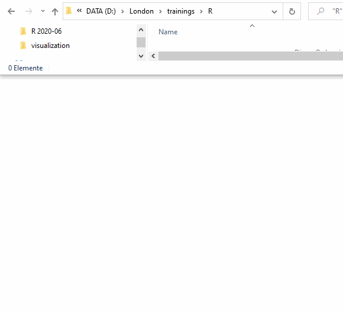


2. We have installed the package `stylo` 
[above](#installing-stylo-and-its-dependencies). However, in order to be able
to use its functions in our current `R` session, we need to load the package. 
The main function of the `stylo` package is called `stylo()`.
Try running this command: 

```
> stylo()
```

RStudio will display an error message: 

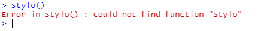

This is because we have not loaded the `stylo` package yet; `R` is blissfully
unaware of the names of functions in an installed package until it is loaded 
in the current session. 
In order to use the `stylo()` function of the `stylo` package, we have to load
the package first. `R` uses the `library` command to do that; 

```
> library("stylo")
```

After we have run this command, we can try again:

```
> stylo()
```

This time, RStudio will not display an error, but a popup will open that 
contains `stylo`'s graphical user interface (GUI):


For an overview of all the options in the GUI, see the "STYLO R Script Mini HOW TO"
file in the course's Google Drive. 

NB: for Arabic-script languages, set the `LANGUAGE` option in the `INPUT & LANGUAGE`
tab to `Other`.

