# Working with GitHub

GitHub is primarily a software development platform but it is very useful as well 
for other projects that require intensive cooperation and/or version control.

GitHub uses the distributed version-control system Git
([https://en.wikipedia.org/wiki/Git](https://en.wikipedia.org/wiki/Git))
for keeping track of changes to files on each of the different
developers' machines. GitHub also offers additional features that
facilitate collaboration within the core team, collaboration with
outside contributors and interaction with users.

## Why use a version control system?

(adapted from
[https://swcarpentry.github.io/git-novice/01-basics/index.html](https://swcarpentry.github.io/git-novice/01-basics/index.html)
)


Even if working alone, you quickly run into multiple versions of the
same document. This problem is compounded when working in a team.

Version control systems start with a base version of the document and
then record changes you make each step of the way. You can think of it
as a recording of your progress: you can rewind to start at the base
document and play back each change you made, eventually arriving at your
more recent version.


Once you think of changes as separate from the document itself, you can
then think about "playing back" different sets of changes on the base
document, ultimately resulting in different versions of that document.
For example, two users can make independent sets of changes on the same
document.


Unless multiple users make changes to the same section of the document -
a [conflict](#solving-merge-conflicts) - you can incorporate two sets of changes into the same base
document.


A version control system is a tool that keeps track of these changes for
us, effectively creating different versions of our files. It allows us
to decide which changes will be made to the next version (each record of
these changes is called a commit), and keeps useful metadata about them.
The complete history of commits for a particular project and their
metadata make up a repository. Repositories can be kept in sync across
different computers, facilitating collaboration among different people.

GitHub uses the version-control system Git
([https://en.wikipedia.org/wiki/Git](https://en.wikipedia.org/wiki/Git)).
Git is called a "distributed" version-control system because the change
history of a repository is maintained not only on a central server, but
also in each copy of the repository (we will see later that these changes
are located in a folder called `.git` at the root of the repository).

## Installing Git

### On Windows

(instructions from
[https://www.pluralsight.com/guides/using-git-and-github-on-windows](https://www.pluralsight.com/guides/using-git-and-github-on-windows))

Download Git for windows here:
[https://gitforwindows.org/](https://gitforwindows.org/)

Execute the downloaded file. A few notes on the options you will be given during the installation process:

* In the page Select Components you can leave
the options at their defaults.

* The Windows Explorer integration \> Context menu entries option allows
opening the Git command prompt (Git Bash) from any folder by clicking
with the right mouse button on the folder and selecting Git Bash Here.
The last option is also interesting in that it installs a better font
for all console windows.

* On the next screen (Adjusting your path environment), choose the most
conservative option: Use Git Bash only. This will make git commands
available only in Git Bash and will not alter your PATH variable. Click
Next.

* Another important setting: line endings. As you may know, Windows and
Unix systems (Linux, Mac) have different formats of line breaks on text
files. If you write a file with Windows line breaks, another person may
have problems opening that file in Linux and vice-versa. The line
endings setting allows you to normalize this. Choosing the second option
(Checkout as-is, commit Unix-style line endings), that won\'t change the
line breaks when the file arrives but will convert them to Unix-style
when you commit. That way, you don\'t risk committing Windows-style line
breaks and everything is kept in Unix-style. Don\'t worry, even though
you are in Windows, most of the text editors can read Unix line breaks
just fine.

* After that one more Next, Finish, and Git is installed!

### On Mac

(instructions from
[https://www.atlassian.com/git/tutorials/install-git](https://www.atlassian.com/git/tutorials/install-git))

Download Git for Mac here:
[https://sourceforge.net/projects/git-osx-installer/files/](https://sourceforge.net/projects/git-osx-installer/files/)

Follow the prompts to install Git.

### On Linux

(instructions from
[https://www.atlassian.com/git/tutorials/install-git\#linux](https://www.atlassian.com/git/tutorials/install-git#linux))

From your shell, install Git using apt-get:

```
$ sudo apt-get update
$ sudo apt-get install git
```

## Introducing your main git tool: Git Bash

### On Windows

We interact with Git through a program called Git Bash, which was
installed together with Git in the step above. Git Bash is a command
line program, which means you interact with it not by clicking buttons
with your mouse but by writing commands. Only the thought of this may
repulse many humanities scholars, but fear not: it is easy to learn, and
we need only very few commands.

To open Git Bash, right-click on a folder in Windows Explorer, and
choose "Git Bash here"


This will open the program:

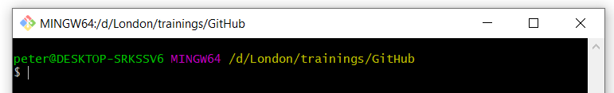


### On Mac

If you are a Mac user, you are probably familiar with the standard Mac
command line tool, Terminal. You can use Terminal to interact with Git,
or install a dedicated command line tool for Git, called Git Bash:

* To open Terminal, do one of the following:

    - Click the Launchpad icon
      in the Dock, type "Terminal" in the
     search field, then click "Terminal".

    - In the Finder , open the `/Applications/Utilities`
     folder, then double-click "Terminal".

* To install Git Bash: download it from here:
[https://downloads.digitaltrends.com/git/mac](https://downloads.digitaltrends.com/git/mac)

### On Linux

If you're using Linux, you don't have to download the Git Bash program;
you can use the normal terminal to interact with Git. 

To launch the shell, use the keyboard shortcut `Ctrl-Alt-T`.

You can use all
normal Linux commands (`cd`, `ls`, ...), in addition to a number of
additional git commands that will be explained below.

## Absolute minimum knowledge of command line commands

**NB: to learn anything from a tutorial, you have to do all the steps yourself, not just read it!
Also, type the commands yourself, do not simply copy them, you will learn much faster this way.**

There are basically two main ways to interact with a computer. The one you are
probably most familiar with, is through a graphical user interface (GUI), in 
which different programs are represented by graphical icons, on which you can
click with your mouse to open them - that is, the way we usually interact
with a computer. The other way is through a command-line interface (CLI),
which uses only text to interact with a computer: instead of clicking on
different icons on the screen with a mouse to tell the computer what to do, 
you use the keyboard to write the commands to the computer directly. 

Even though most modern computers mainly use a graphical user interface (GUI), 
each also has a program that allows you to interact with the computer through 
text commands. Such a program is known by many names: "terminal", "command line",
"command prompt", "shell". 

To interact with GitHub, we will use such a command-line interface: on Windows, 
you can use Git Bash; on Mac, you can use Terminal (or Git Bash); and on Linux 
the standard Linux terminal. For instructions on how to install/open these, see the 
[previous](#introducing-your-main-git-tool-git-bash) section. 

In this tutorial, we will be using Git Bash. If you use a different program, 
it might look slightly different, but it should still be recognizable,
and the commands you have to enter are the same.

1. Open the command line shell of your choice. this is what it should look like: 
basically, a black (or white) window, with some text at the top.


  

  

  

  The displayed text on your machine will be different than in the image here: it contains:

  * basic information on your computer and the user who is logged in: `<user>@<system>`
  (in the images above: `peter@Desktop-sRKSSV6`, `bigsur@Andrews-MacBook-Pro`, `mark@linux-desktop`)
  * information on your location in your computer system
  (in the images above: `/d/London/trainings/GitHub`, `~` and `~` ; `~` refers to
  the home directory on Mac and Linux computers)
  * the **prompt**: a symbol that shows that the shell is ready to accept your commands 
  (in the images above: `$`, `%` and `$`; the exact symbol differs depending on 
  the program and/or the user account type (normal user, administrator) 
  that is logged in)
  * the **cursor**: a blinking bar or rectangle that shows the position where a 
  character will appear when you hit a key on your keyboard.

NB: this whole line (in the Windows example, two lines) is usually called the
command prompt, or simply prompt.

<mark>**IMPORTANT** In this tutorial, we will include the dollar sign before every
line that should be executed in Git Bash; you don't have to write it in
Git Bash when copying commands from this tutorial.</mark>

2. Write your first command: type `pwd`, which means "**p**rint **w**orking **d**irectory": 

```
$ pwd
```

(remember not to type the prompt symbol `$`!)

3. Press the "Enter" key to execute the command. A line that contains the path
to your current folder will appear, and beneath it, a new command prompt: 

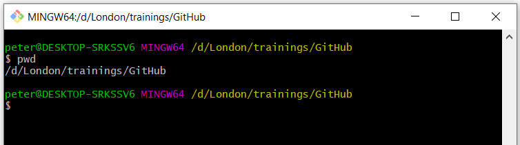

NB: to know what this path means, please go on to read the next section.

In general, you will always have to hit enter to execute a command, 
and any output from the command will be printed to the line(s) below the
line on which you wrote your command. When the computer is ready executing your
command, a new prompt will appear, signalling that it is ready to execute
a new command. 


### The filesystem: an introduction
Each computer has a system to organize all the files in it; this is called its
filesystem. Files are usually kept in logical groups, which are called "directories"
or "folders" - think of the cardboard folders in which you store paper files. 

A physical library is organized in a way that facilitates retrieving a book:
this makes it easy for a user to go and fetch a book if she 
knows it is stored in room 2.03 on the second floor of the building, in book 
case number 8, on the third shelf. The filesystem in a computer is organized in 
a similar hierarchical way. Each file is contained in a directory, which is itself
contained in another directory (called its `parent`), and so on until it reaches 
the `root` directory, which contains all other directories. The image is that of
a tree, where each directory is a branch, and each file a leaf. There is a unique 
`path` that describes the way from the `root` directory to any directory or file
in the filesystem. 

The shell knows in which directory it is currently located; this is called its 
"working directory". Any command you write in the shell will be executed in 
the shell's current directory; for example, if you write a command to create
a new file (the command to do create a file called "my_file.txt" `touch my_file.txt`),
this file will be created in the current working directory. 

The `pwd` command shows the `path` to that directory from the `root` directory. 
In the example above, the `root` directory is symbolized by the first forward 
slash `/`; the following slashes in the `path` delineate directory names. 
The `GitHub` folder is located within a directory called `trainings`,
which in turn is located in a folder called `London`, which in turn is located in
the `d` directory in the `root` folder of my computer. 
The path `/d/London/trainings/GitHub` tells the computer it can find the `GitHub`
folder by opening the `d` directory in the `root` folder, then the `London` folder
in the `d` directory, then `trainings` folder inside that `London` folder. 

### Moving from one directory to another: the `cd` command

We can use the command `cd` (for "**c**hange **d**irectory") to move to another folder.
For this first exercise, we are going to move from our current working directory
to the root folder, and then move our way back up to the original working directory. 

1. First use the command `pwd` to print your current working directory,
so that we know the full path to our current working directory and can get back 
to it later: 

```
$ pwd
/d/London/trainings/GitHub
```

(again, don't include the `$` symbol in your command - it symbolizes the prompt!)

NB: the output on your computer will of course be different, as it depends on 
the file structure on your computer and your current location within it!

2. To move to the root folder, you can use this command: 

```
$ cd /
```

3. if you enter the `pwd` command again, it will now show only the forward slash
that symbolises the root directory: 

```
$ pwd
/
```

The working directory is also reflected in the prompt itself: 

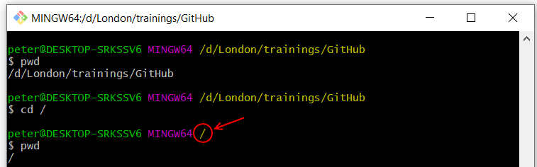

(the exact way how this is represented in the prompt will differ from system to system)

4. Let's start moving back in the direction of our original working folder
(in my case, `/d/London/trainings/GitHub`; in your case, the path that was 
printed in step 1). Let's go step by step: first write `cd`, followed by a space,
followed by the first directory in the path (in my case, `d`) - you may choose
to include the slash after the directory name or not; press the Enter key.
Repeat for the next directory: `cd ` + the next directory in the path (in my
case, `London`), and Enter:


5. You can also take larger steps, by stringing directories together with forward
slashes, as in the path we printed with the `pwd` command. Since we are currently
in the `London` folder, we can write the following command to reach the `GitHub`
folder:

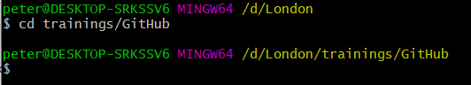

6. To move to the `parent` folder (that is, the folder that contains the current 
working directory, the folder immediately before the working directory in the 
path): use the command `cd ..`:
         


### More navigation in the command line: the `ls` command

1. To list all files and folders in the current working directory, use the command
`ls` (for "list").


This will display all files and folders in the current working directory. 
You can use this information to move into one of these folders. 

2. You can also list the contents of another directory than the working directory, 
by adding the path to that directory after `ls`. For example, if we want to list
the contents of the `GitHub` folder while we are in the `trainings` folder, we can
write: 
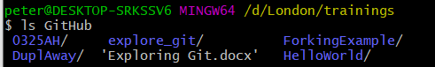

NB: note that Git Bash displays folders in blue (followed by a forward slash), 
and files in white. Note also the quotation marks around the file name; they
are there because the file name contains a space. If any folder or file name in
a path contains a space, you will have to use quotation marks around it.


3. Similarly, we can list the contents of the `root` folder from anywhere in the 
filesystem tree (in this example, again from the `trainings` folder):

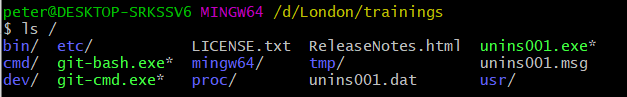

4. ... Or use the full path to any folder: 


### Using autocomplete

Most (all?) command line programs provide an **autocomplete** functionality. 
You can write part of a folder or file name and press the `Tab` key on your 
keyboard, and the program will try to complete the folder/file name. 

For an example, I will cd into the `root` directory (`cd /`). If we want to return 
to the `GitHub` folder, we can type `cd d/Lon`, and hit `Tab`; the program will 
autocomplete to `cd d/London/`, because there is no other file or folder in 
the directory `d` that starts with `Lon`. We can then continue typing `trai`,
and hit `Tab` again to autocomplete to `cd d/London/trainings`. I can then type `Gi`
followed by `Tab` to autocomplete to `cd d/London/trainings/GitHub`.


## Essential GitHub commands

We will be covering the following commands during this tutorial: 

```
git clone
git status
git add
git commit
git push
git pull
git remote add
```

These few commands will be enough to do most of your work on GitHub. 
That's not too bad, is it?

## Creating your first GitHub repository

A repository is a folder that contains a git project. You will create a repository
for each project you are starting. 

Go to GitHub.com. 

**If you don't have a GitHub account yet, create one now by 
clicking the `sign up` button and go through the  sign up process.
To finalize the process, you have to click a link sent to the email address
you used to set up the GitHub account**

Log in to your account by clicking the `Sign in` button in the top right of the window. 

Once you're signed in, you'll see an automatically created personal avatar in 
the top right of the window;if you click on it,
you'll see your user name and a couple of links: 


Create a repository by clicking the plus sign next to your avatar, and selecting 
"New repository" from the dropdown list: 


Give your repository a new name. It is a tradition in computer programming to 
call your first project "Hello World". GitHub does not allow spaces in repository
names, so let's call ours "HelloWorld". Also add a short description. 


GitHub gives you a couple of additional options: the repository can be either 
public (meaning, anyone on the internet can see it, but you can decide who
can make changes to it) or private (meaning it is invisible, but you can 
invite specific people to view your repo and participate in it). 

GitHub also offers you to create your repository with some files included from 
the start: a README file explaining what this project is about, a .gitignore file
(which describes which files should never be copied when downloading and uploading
to GitHub - more on this later), and a license (which describes how people can
use your project - copyright-wise). 

Let's create the repository without any of these files, and click the green 
"Create Repository" button.

When the repository is created, you arrive at a landing page, which explains 
very shortly what the next steps could be: 

* manually create a new file in the repository
* upload an existing file to the repository
* connect your new repository to a folder on your local computer
* use the command line to add data from an existing folder on your local machine
    to this git repository
* import code from another repository    

We'll use the first option and create a README file: click the "creating a new file"
link in the "Quick setup" section of the landing page:


Give a name to the file: we'll call it `README.md`:


NB: `.md` is the extension for markdown files. 
Markdown is a lightweight markup language that allows you to format a text with 
title headings, bold, italics, etc. using a small amount of special characters. 
See a cheatsheet with an overview of the syntax elements here: 
[https://www.markdownguide.org/cheat-sheet/](https://www.markdownguide.org/cheat-sheet/).

It is a very useful format for writing things for the internet - this tutorial 
was also written in markdown.

Let's write some markdown text in the README.md file:


If you click the Preview button, you can see the effect of the special characters
`#` (first-level header), `**...**` (bold) and `*` (unordered list) is: 


At the bottom of the page (you may have to scroll down) you will find a message
box titled "Commit new file". `Commit` is an important git command: every change
you make in a git repository will be saved with a short descriptive title ("commit message") 
for later reference, so that other users (or yourself) can go through the history
of changes and roll back changes if necessary. 

The commit message is usually a very short message (about 50 characters), 
in the imperative form. You can write it in the smallest of the two input fields.
You will see that GitHub has already provided you with a proposal for your first
commit message: "Create README.md"
You can also add a more extensive description in the larger input field; this
is optional. 


In order to save our changes, we have to click the green "Commit new file" button.

That's it, you have created your first GitHub repository with your first README file, 
and you made your first commit!

If you want to edit the `README.MD` file, you can click the pencil icon:


Don't forget to write a new commit message and click the `Commit new file` button
if you have edited the text of the README file!

You can see the history of our commits by clicking the `History` button under
the green "Code" button:


This will show you all changes (commits) in the repository, from newest to oldest:


## Cloning: downloading a GitHub repository

Now that we have created our first GitHub repository, let's download it to our
personal computer, and make some more changes there. The process of downloading
a repository from GitHub on your local computer is called "cloning". Remember,
every local copy of a git repository contains the entire history of the repository,
and is thus effectively a clone of the repository. 

Go to the page of the repository you want to clone on GitHub, and click the 
green `Code` button. This will open a dropdown, which contains - among other 
things - a download link (usually, it will be the address of the GitHub page,
with a ".git" extension appended to it). Click the clipboard icon next to that
link to copy the link to your clipboard. 

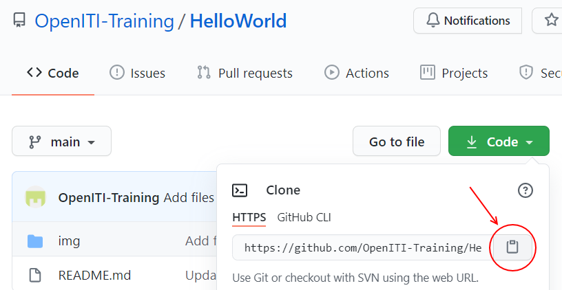

Open the command line program you use for git (Git Bash, Terminal, Linux shell
- see [above](#introducing-your-main-git-tool-git-bash) for instructions)
and navigate to the folder where you want to save a copy of our HelloWorld repo. 
I will save it in my `d/London/trainings/GitHub` folder; you will have to use the
`cd` command with the path to a folder in your file system instead 
(see above for more info on the [file system and paths](#the-filesystem-an-introduction) and on the 
[cd command](#moving-from-one-directory-to-another-the-cd-command))


Write the following command: `git clone ` and paste the link from the clipboard,
and hit enter. In the case of the repo we created in the previous section, this 
would be 

```
$ git clone https://github.com/OpenITI-Training/HelloWorld.git
```

NB: in Git Bash on Windows, you cannot use the normal shortcut for pasting 
(`ctrl+v`); use `shift+insert` (or right-click, and choose `Paste`) instead.

The program will print a number of lines to the screen, detailing its progress: 


Congratulations, you cloned your first repository!

Let's navigate into the folder, and let's see what is in there. Use the command 
`cd HelloWorld` to move into the `HelloWorld` folder, and then write the command
`ls -la` to list all files in that folder (you already know the 
[`ls` command](#more-navigation-in-the-command-line-the-ls-command);
the characters `-la` at the end are so-called "flags" that change the behaviour
of the command: `-l` tells the program to list some details about each element
in the folder, and `-a` to include all files, including those that start with `.`).


The last item is probably the only one you expected: the README.md file we 
created on the GitHub page. The first two items in the list refer to the 
current folder (`.`), and its parent folder, that is, the folder that contains
the current folder (`..`, remember the `cd ..` command).

The most important item in the list is the `.git` folder; this folder contains 
the entire history of the repository. 

## Save your changes: add and commit

Now that we have cloned our GitHub repository, we can work with it: add new 
files and folders, make changes to existing files or delete them altogether.

Whenever you have made a change to your local repo, you have
to notify Git that you did so. It is the Git equivalent of using "save
as". Git stores changes you made under the form of files known as "commits"; each
commit has a unique id number, and a label ("commit message") that
describes in about 50 characters what changed to the repository when
this commit was made. This allows a user to go back in the history of
the repository, for example to return to earlier versions of a file.

1.  Make a change in the README.md file, using Kate editor. Make sure to save
     and close the file after you finished changing it.
     
     NB: You can open Windows Explorer in the current directory from Git Bash 
     using the following command:
     
     ```
     $ explorer .
     ```
     
     On Mac, use `open .` instead to open Finder in the current directory.

2.  In Git Bash on your computer, use the `cd` command to move into your
     local repository:
     
     ```
     $ cd d/London/trainings/HelloWorld
     ```
     
     NB: use the path to the folder where you stored your HelloWorld repo,
     which will be different from the one shown here!

3.  You can use the command `git status` to make Git check which files
     in your local repository have undergone changes:
     
     ```
     $ git status
     ```
     
     If no changes occurred, you will get the following message: 
     
     ```
     On branch master
     Your branch is up to date with \'origin/master\'.
     nothing to commit, working tree clean
     ```

     If you have made changes, Git will return a list of the files that have 
     been changed (or added/deleted):

     
     
     For this example, we have changed the README.md file. Git displays it in 
     red to show that the changes to this file have not yet been stored in Git.


4.  We will now commit our changes to git, which will save them in the `.git` 
     folder on our computer. 
     A commit is like a box in which changes are saved. First you have to
     add the changes to the box using the `git add` command, followed
     by the path to the file you changed - in our case, simply: 
     
     ```
     $ git add README.md
     ```

5.  If you use the "git status" command again, you will see that the
     file we changed is now displayed in green: the changes are in the
     commit box, ready to be committed to the storage system.
     
     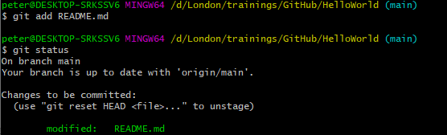

6.  Using the command `git commit`, we will commit our changes to the
     storage system. For later reference, we have to add a "commit
     message": a label to the commit box, so to say, that should help other
     users to understand the changes you made to the file without
     having to compare both files.
     The commit message should be introduced with the flag `-m` (for "message"), 
     and be placed between (single or double) quotation marks:
     
     
     
     This is equivalent to hitting the green `Commit` button on the GitHub website
     
     NB: a good commit message should be around 50 characters long, be
     descriptive, and in the imperative mood: the idea is that when you
     go through the history of changes made to a repo from the start,
     you can read the commit message as "when you execute this commit,
     Git will..."

7.  Your changes have now been included in the change history. You can
     view the change history with the command `git log`:

     

     This gives you a list of all changes (commits) made to the repository,
     from the most recent to the oldest.
     As you can see, every commit has a unique 40-character ID that can be used
     to go back to the state of the repository when this commit was made. The 
     log also lists the author and date of every commit, plus its commit message.
     
     NB: if the number of commits exceeds the Git Bash window, the log will open 
     in an editor within Git Bash. 
     You can use the `UP` and `DOWN` arrows on your keyboard to
     navigate through this history.
     To quit the log, type "q" after the colon at the bottom of the
     window.
     

## Publish your changes: push changes

Now you have committed your changes in your local Git repo, but if you
go to your personal GitHub page, you will see that the changes you made
in your local repository are not present there. 


The online repository on your GitHub page (your "remote" repository in Git-speak)
is not automatically updated when you add and commit to your "local" repo.

In order to update the remote repository, we will have to "push" our
changes to GitHub. 

1.  In Git Bash on your computer, use the `cd` command to move into your
     local repository if you were not in it already:
     
     ```
     $ cd D:/London/trainings/GitHub/HelloWorld
     ```

2.  Use the command `git push origin main` to push your changes to
     your fork on your personal GitHub page:
     
     ```
     $ git push origin main
     ```
     
     NB: `origin` is the default name for any remote repository you clone on your computer; 
     `main` is the default name of main branch within that repository. 
     So, this command means "push the changes on the active branch of this repo 
     on my local computer to the `main` branch of the remote repository 
     it was cloned from (`remote`)". You can see the name of the active branch
     in your repository in Git Bash: 
     
     
     
     Branches are an important concept in Git (see 
     [here](https://docs.github.com/en/free-pro-team@latest/github/collaborating-with-issues-and-pull-requests/about-branches)
     if you want to learn more), but are outside the scope of this tutorial.
     
     NB: `main` has become the default name for the main branch of a repository
     on GitHub only recently; in repositories created before October 2020, 
     the default name was `master`. This change is the result of a 
     [backlash](https://www.allaboutcircuits.com/news/how-master-slave-terminology-reexamined-in-electrical-engineering/)
     against the use of words with slavery connotations in computer science and 
     engineering.

3.  If we go to our personal GitHub page now, we will see that our
     changes are now also visible in our remote repository. Our commit
     message is displayed at the top.
     

## Workflows for collaboration with Git

There are different ways how you can incorporate Git in team projects. We will
describe two here that are relevant for us: 
* the **centralized workflow**, where there is one central repository to which all 
contributors **push** their changes;
* and the **forking workflow**, where contributors cannot push changes directly 
to the central repository; each contributor to the project creates a copy
("fork") of the central repository, and requests the maintainer of the central 
repository to pull their changes ("pull request"). 

Each of these has its advantages. 

### The centralized workflow

#### Adding collaborators to your personal repository

The Git workflow described above (cloning a repo to your local machine and pushing
back changes to GitHub) is useful when you use GitHub as a storage for your
own personal projects. It can also be used for small team projects, such as 
the projects in this course, if the tasks are split clearly and chances are 
low that two persons will work on the same file at the same time. 

As mentioned above, you can give others write access to a repository you own - 
whether it is public or private. To do this, go to the "Settings" tab on the top 
of your repository (make sure you are logged in to your GitHub account):


Click `Manage access` in the side bar: 


You may be prompted for your password; provide it if asked for it.

Click the green "Invite a collaborator" button: 


Ask your collaborators' GitHub usernames, and search for them in the search box;
once you found them, click their user name.

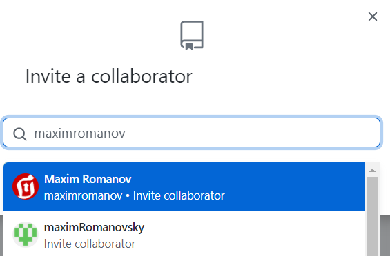

Finally, click the green button to add the collaborator to your repo: 


This person will now have the same rights as you have to push changes directly
to the repository, just like you do. 

#### Keeping up to date with the remote branch: `git pull`

If more than one person is collaborating on a repository, it becomes very 
important that all versions of the repository are up to date. 

Every time before you start work on your local repository, make sure to synchronize
it with the remote repository. 
In Git Bash, use the command `git pull` within your local repository to do this: 

```
$ git pull origin main
```

This will fetch all the changes other contributors pushed to the repository
and make sure your local repository is identical with the remote repository 
(`origin`).

Similarly, every contributor will have to make sure that they push their changes 
to the remote repository regularly, to avoid that different clones of the repo
drift apart. 

```
$ git push origin main
```

NB: The `git pull` command is obviously the counterpart of the `git push` command;
the imagery is of a box with changes being pulled from or pushed to another
repository. 


#### Overview of the git clone - pull - push workflow

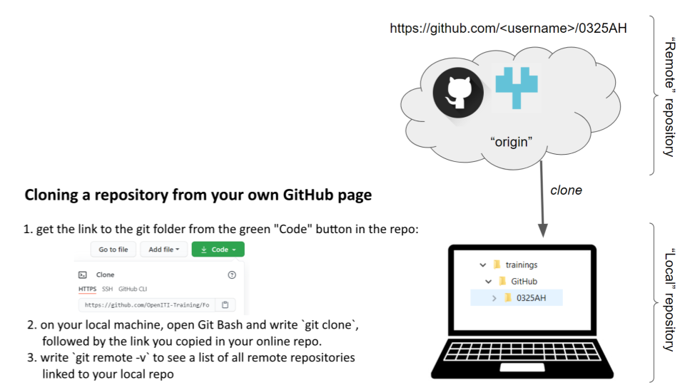


### An alternative workflow: forking and pull requests

#### introduction
The GitHub workflow described above works well for personal projects and for 
small projects where all collaborators know each other and have clearly distinct
tasks on which they work.

However, in many projects, outside collaborators will not be given the right
to directly push their changes to a repository: this would open the door to 
undesired or low-quality changes and even digital vandalism. 

An alternative workflow exists that is much safer and involves peer review of 
any change made by external collaborators. In this workflow, external
collaborators create a copy ("fork") of the repository on their own personal 
GitHub page, clone this fork to their local machine. When they have made
their changes (and added and committed them to Git), they push their local
changes to the remote fork on their own GitHub page, and request the owner of 
the original repo to review and accept their changes. 
In line with the `push` and `pull` imagery,
this request is called a `pull request`: instead of pushing your changes to
the original repo, you request that the owner of the repo pulls them in. 


NB: the term "fork" does not refer to the eating utensil but to the image of a 
fork in a river, the place where a large branch splits off from the main branch 
of the river:


If a repository is popular, it will not look like the Nile but like the Upper 
Columbia river, with many forks taking off and rejoining at a later point: 


#### The forking and pull requests workflow

You can create a personal copy of any (public) repository on GitHub if you have
a personal GitHub account. In this tutorial, we will create a fork of this repo: 
https://github.com/OpenITI-Training/ForkingExample

1. Go to the repo's page on GitHub and click the "Fork" button in the top right 
corner to create a copy of this repository on your personal GitHub account. 


2. If you look at the adress bar in your browser, and the title of the repository, 
you will see that you have now moved into a copy of the repository on your own 
GitHub page


3. Make some changes to your fork of the repo; for this tutorial, we will add a 
text file to the fork. We are going to use the `Add file > Upload files` function 
on GitHub itself:


  GitHub will offer you the possibility to drag and drop a file, or choose them
  from a file selection box.After adding the files, provide a commit message
  and hit the green `Commit changes` button.

4. Create a pull request to send your file to the original ("upstream") repository:
click the `Pull requests` button under the name of the fork repository on your
personal GitHub page:

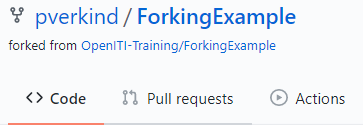


5. This will bring you to a new page, where you can compare changes between
different forks of the original repository. To create a pull request, make sure
your fork is in the `head repository` field, and the original repository from 
which you forked in the `base repository` - the arrow shows the way the data 
will flow. Then click the green `Create pull request` button.

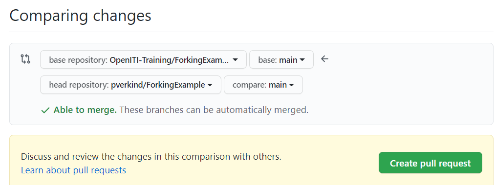


6. Provide a title and description for your pull request and click the green 
`Create pull request` button.

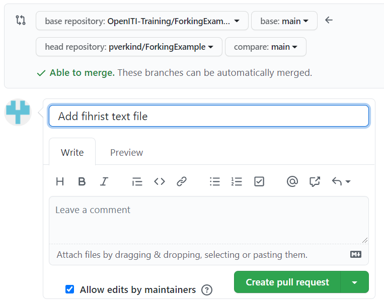

7. The owner of the repo you cloned will be informed by email that you have 
made a pull request. They will review the changes you made; if they are happy
to integrate them, they will merge you changes into the repository. They may
also choose to comment on your changes and ask you to amend them before they
will accept them. The `Pull request` is not only a security measure, but also
an important communication channel on GitHub. 


#### The forking and pull requests workflow in more detail

In the previous section we took a shortcut in order to provide a quick introduction
to the concepts of forking and pull requests: we uploaded a file to the fork on
our GitHub page.

In most cases, however, you will want to make changes on your local machine. In 
order to do this, we will have to clone the fork to our local machine, as we did
in the centralized workflow (for details, see above). But to keep up to date
with the original repository, we will have to create an additional direct link to 
that repository, so we can pull changes directly from that repo.

1. Fork the repository to your own GitHub account: click the `Fork` button.
2. Clone your personal fork to your local machine: copy the link displayed when
   you click the green `Code` button, and in Git Bash on your
   computer, enter the command `git clone ` + the link. 
3. Move into the repository you cloned by using the `cd` command:
   


4. Let's see the remote repositories connected to our local repo; will there 
  already be a connection with the original repo? 
  


  No: there is only a connection to the fork on our personal GitHub page. 
  As you can see, this remote repository is called "origin"; this is the default
  name, created by Git when you use the command `git clone`. 
  It is mentioned twice, because we are allowed to push to and pull (fetch) 
  from our own remote repository.

5. Create a connection with the original repo: go to the GitHub page of that repo,
   get the link to that repo by clicking the green `Code` button. Now go back
   to Git Bash and enter the command `git remote add upstream `, followed by 
   the link to the original repository: 
   
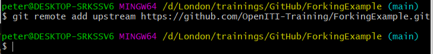
   
  NB: `upstream` is the name we give to the original repository; you can give it
  any other name if you like, but it is common to call it `upstream`, so better
  to stick with the traditions. `upstream` uses the same river imagery as `fork`.
  
6. If we use the command `git remote -v` again, we will see that a new remote 
  connection has been added to our local repository: 
  


  NB: note that `upstream` is mentioned twice in the list, once for `fetch` and
  once for `push`. However, if you would try to push to the `upstream` repo,
  you would get an error message. This is because Git does not restrict you
  from pushing to that repository, it is GitHub that restricts push access. 
  
7. Before making any changes, it is a good idea to pull any new changes other
users of the original repo (`upstream`) may have made in the meantime. 

  If nothing had changed, you will receive the message `Already up to date`: 
  
 
  If, however, changes have been made to the `upstream` repo since you forked it,
  or since you last synched your local repo with the `upstream` repo, Git Bash 
  will download and list the changes that have been made in the `upstream` repo:


  It will then display a notification that the `main` branch of the repository will be merged 
  into the `main` branch of your local repository. This message will be shown
  in an editor inside Git Bash; you can adapt the message if you wish, but it is
  usually fine to keep the default message and simply close the editor with 
  the key combination `Ctrl` and `X`. The editor will ask whether it has to
  save your changes; write `Y` and hit the `Enter` key. Hit `Enter` again to 
  confirm Git may store this file at the proposed location.
  
  NB: the merging of the two branches is stored in a commit; the message in the
  editor will function as its commit message. 
  
  

  NB: if you have made changes to a file on your own computer, 
  and someone else has meanwhile made changes in the upstream repo to the same 
  line in that same file, this leads to a "merge conflict": Git cannot decide 
  which change to keep. You will have to resolve this merge conflict by [manually 
  selecting which changes to keep](#solving-merge-conflicts): the one you pulled from the OpenITI GitHub 
  page, or the one you made locally. This can be a huge pain. In order to avoid 
  this, always make sure to pull the changes from the upstream repository 
  before you make any change to your local files!


8. Now let's make some changes to our local repository. We will create a new (empty)
  file in this example that has our initials as its filename. 
  You can do that by using the command `touch`, followed by the filename:


  If you type the command `ls` to list the content of the working directory, 
  you will see that it now contains a file with that filename.
  
9. Let's now commit our changes to Git using the commands `git add` and 
  `git commit -m`: 
  


10. After committing your changes, and before pushing them to GitHub, it is 
good practice to pull changes from the `upstream` repo again (see above): 

 

11. Let's try to push our changes directly to the `upstream` repo - we already 
know this is not going to work, but let's try anyway to see the error message: 

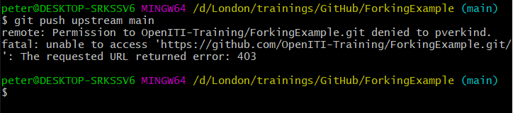
  Git tried to push our commit to the server, but GitHub denied us access. 
  
12. We have to take the detour of the pull request to publish our changes to 
the original repository. First, we push our changes to the remote repository 
(`origin`) on our personal GitHub page:  

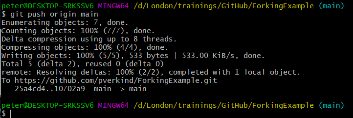

13. Now we can create the pull request as we have done before: push the `Pull 
requests` button under the name of your fork on GitHub: 


14. This will bring you to a new page, where you can compare changes between
different forks of the original repository. To create a pull request, make sure
your fork is in the `head repository` field, and the original repository from 
which you forked in the `base repository` - the arrow shows the way the data 
will flow. Then click the green `Create pull request` button.


15. Provide a title and description for your pull request and click the green 
`Create pull request` button.


16. The owner of the repo you cloned will be informed by email that you have 
made a pull request. They will review the changes you made; if they are happy
to integrate them, they will merge you changes into the repository. They may
also choose to comment on your changes and ask you to amend them before they
will accept them. The `Pull request` is not only a security measure, but also
an important communication channel on GitHub. 

#### Overview of the Forking workflow: 

The following images are a graphical representation of the Forking workflow,
illustrated by an example drawn from the OpenITI corpus.


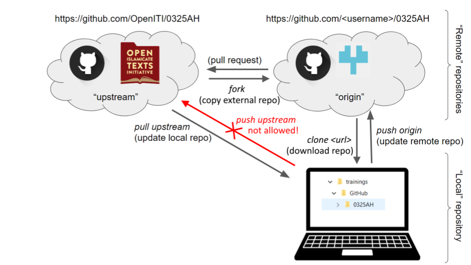


### Comparison of both workflows

| **push access**                              | **forking - pull requests**            |
|----------------------------------------------|----------------------------------------|
| changes immediately reflected in remote repo | changes only accepted after review     |
| no quality control                           | quality control through review process |
| less overhead: give permission only once     | every change must be reviewed          |

Both workflows can be combined. For example, in the OpenITI project, the core 
technical team has such push access to most of the project's repositories, but 
external contributors have to fork a repo and make pull requests when they want
to contribute texts or metadata to a repo. Thus, the positive aspects of both
workflows can be used.

## Solving merge conflicts

As we have seen before, Git tries to merge changes you make in your local repo
to the current state of the remote repo you push your changes to, and vice versa. 

It is quite smart at doing this; it takes into account at which time each change
was made. 

However, there are cases in which Git cannot know how to merge two versions of
the same file: usually, this happens when two users made different changes to the
same line of text in the same file. 

This is called a "merge conflict": Git does not know which of the changes is better,
and it will let you decide which change to keep, and which one to discard. 

To simulate this, let's use our HelloWorld repo, and make changes to the same 
line in our local repo and in the remote repo (`origin`). 

1. In the repository on GitHub, click the pencil icon at the top of the 
README.md document: 

   

2. Make a small change to the first line of the description. E.g., replace
"our training" with "the OpenITI training".

3. Write a commit message in the `Commit changes` box at the bottom of the 
screen and hit the "Commit changes" button. 

   

4. Now, let's make another change in the README.md file of the clone of this 
repository we made on our local machine. Open the document in your favourite
editor, and make another small change to the same line: e.g., replace
"our training" with "the KITAB training".

5. Add and commit the file in your local repo: 

   

6. Now pull the changes from the remote repo (`origin`) to your local repo: 

   

   There you have it, a merge conflict... The error message tells you - kind of -
   what is going on and what you have to do: "Automatic merge failed; fix conflicts
   and then commit the result."
 
   NB: notice that the branch indication at the end of the prompt line has changed
   from `main` to `main|MERGING`: this is a temporary branch. 
 
7. To fix a merge conflict, open the file for which Git found a merge conflict - 
in our case, `README.md` in any text editor (e.g., EditPad Pro, Kate). 
You will notice something strange is going on in the file: 

   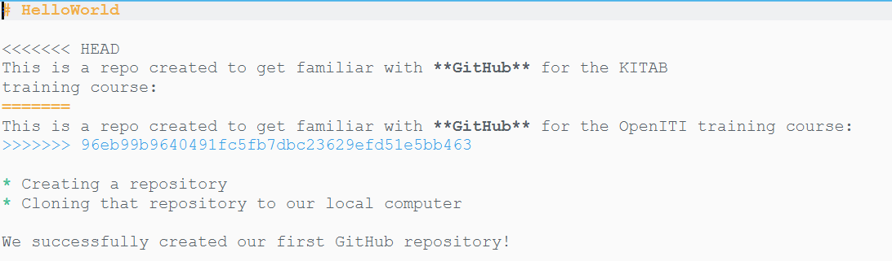

     Git has inserted a number of weird characters into our text file. 
     In fact, these characters show us where the merge conflict is located in the
     text file, and the variants in the two conflicting commits: 
  
      * `<<<<<<<` indicates the beginning of the merge conflict, and `>>>>>>>` its
      end. Both are followed by a commit ID (commit IDs are usually 40-digit
      hexadecimal numbers; `HEAD` is an abbreviation for the commit ID that is
      currently "checked out", that is, the ID of the current state of the files
      in your working directory)
      * `=======` separates both versions of the conflicting line(s)
  
    In order to fix the merge conflict, we can either delete one of the variants,
    create a combination of both, or replace them by an entirely different string.
    For this example, we will keep one version, the one from our GitHub repo. 
    Remove the other version and all merge conflict markers and then save the file:
  
    
    NB: make sure to remove all the traces of the merge conflict markers! 
    It is a good idea to use the search function of your editor to search for 
    repetitions of ">", "<" and "=" to check if you have not overlooked any.

8. After fixing all merge conflicts in all files Git had trouble merging, 
we have to create a commit that records that we have solved all merge conflicts. 
If we first enter the command `git status`, we can see that Git is not yet 
informed that we have solved the merge conflict. 

   Let's `add` and `commit` the `README.md` file:
  
   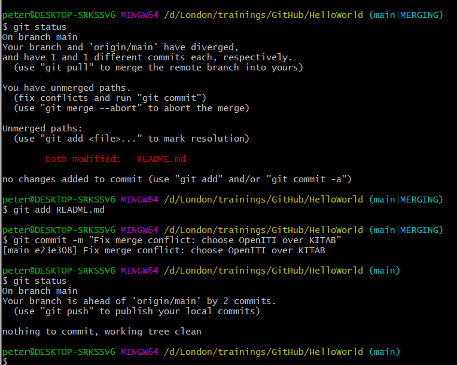

   Running the `git status` command again after adding and committing the `README.md`
   file, we can see the merge conflict is now resolved: gone is the message 
   `both modified:     README.md`, and the branch indication in the prompt line 
   went back to `(main)` from `(main|MERGING)`. 
  
9. To finalize, we should push our changes back to our remote repository (`origin`): 

   
   The message printed after our command `git push origin main` may be cryptic,
   but it shows no sign of a merge conflict. 


## Further reading

This was only a very basic introduction to Git. There are many good resources 
around. 

* Very first introduction to using Github: [https://guides.github.com/activities/hello-world/](https://guides.github.com/activities/hello-world/)
* Introduction to using Github from command line: [https://towardsdatascience.com/getting-started-with-git-and-github-6fcd0f2d4ac6](https://towardsdatascience.com/getting-started-with-git-and-github-6fcd0f2d4ac6)
* A more technical insight into the guts of Git: [http://ftp.newartisans.com/pub/git.from.bottom.up.pdf](http://ftp.newartisans.com/pub/git.from.bottom.up.pdf)
* on different workflows using Git: see [https://www.atlassian.com/git/tutorials/comparing-workflows](https://www.atlassian.com/git/tutorials/comparing-workflows)


