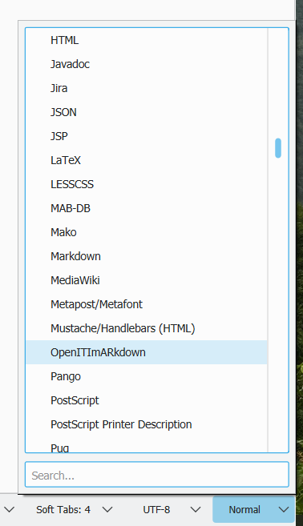
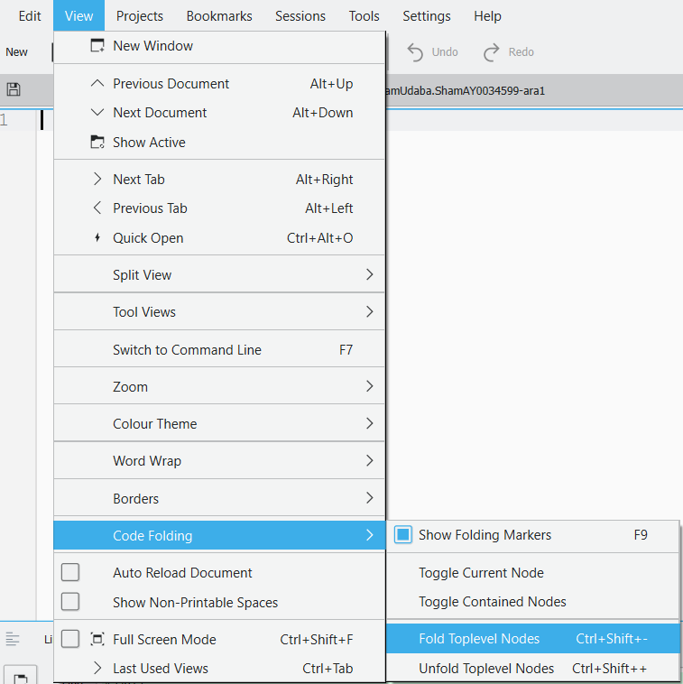
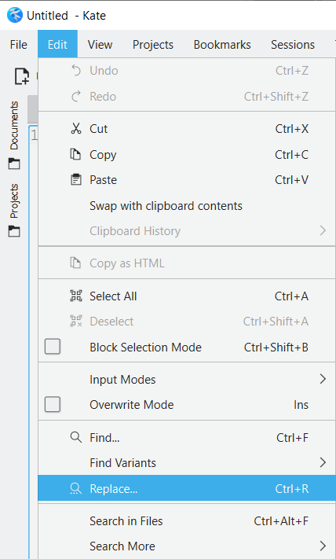
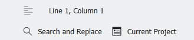
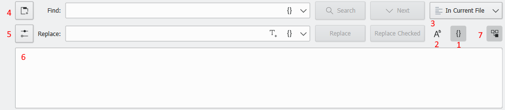
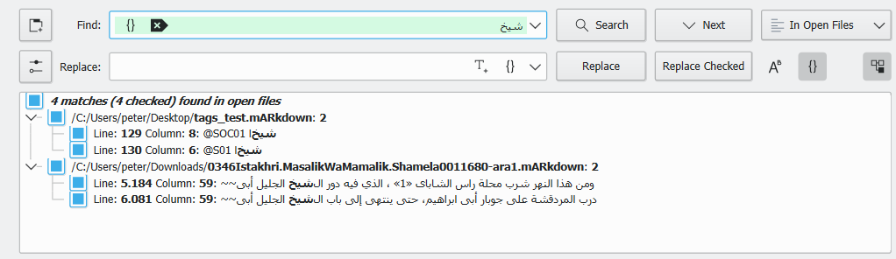
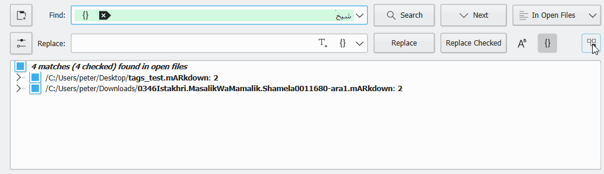
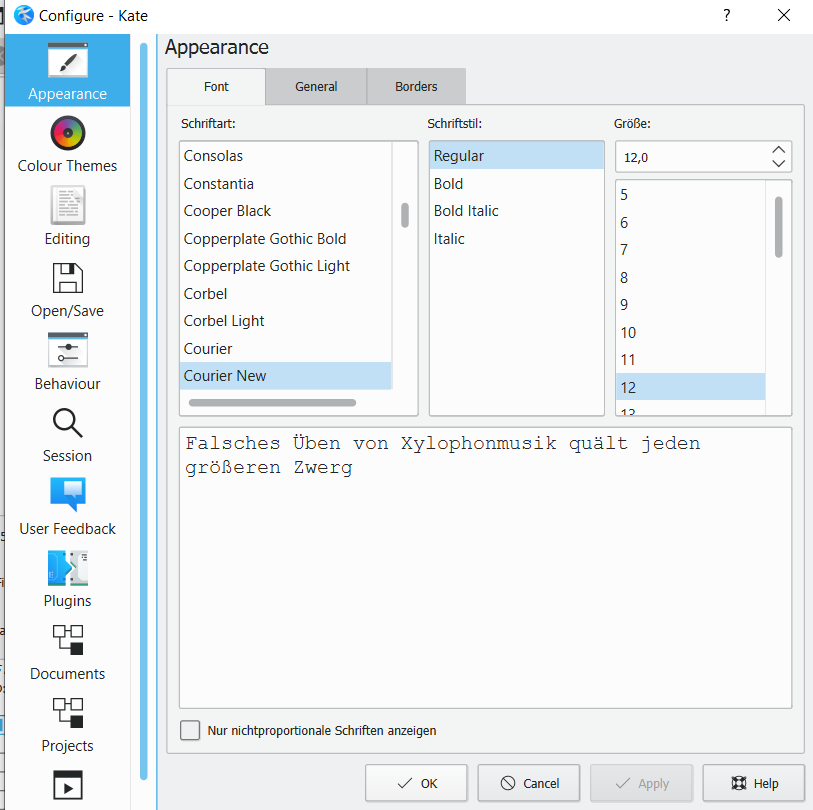

# Kate Tutorial

Kate is a free text editor that can be used on Windows, Mac and Linux alike. 

It has good support for right-to-left scripts, handles large files reasonably 
well, and allows the creation of custom highlighting and folding schemes
(for instructions for installing the OpenITImARkdown scheme, see
[below](#installing-the-openiti-markdown-highlighting-scheme-for-Kate)). 

This tutorial showcases only the most relevant functions of Kate for our purposes;
for more information, please refer to the [Kate Handbook](https://docs.kde.org/stable5/en/applications/kate/index.html), which 
can also be accessed through the `Help` menu in the program itself. 


## Installing Kate editor

### On Windows

* Download the most recent installation file here:   
  [https://binary-factory.kde.org/view/Windows%2064-bit/job/Kate_Release_win64/](https://binary-factory.kde.org/view/Windows%2064-bit/job/Kate_Release_win64/) ; 
  go to the **Pipeline Kate_Release_win64** section on that page and download the file that ends with `_64-cl.exe`.

* Once the file was downloaded, double-click the installation file and follow the instructions (you can keep all the default settings the installer proposes)
 
* Kate should now be installed on your computer. Proceed to install the OpenITImARkdown highlighting scheme (see [below](#installing-the-openiti-markdown-highlighting-scheme-for-Kate))


### on Mac

* Download the `.dmg` file here: 
  [https://binary-factory.kde.org/view/MacOS/job/Kate_Release_macos/](https://binary-factory.kde.org/view/MacOS/job/Kate_Release_macos/)
  (choose the file that ends with `.dmg`, the other file is a 
  [checksum](https://www.howtogeek.com/363735/what-is-a-checksum-and-why-should-you-care/))

* Once downloaded click on the .dmg file, double click on the “kate” icon or drag it to the Applications folder 

    NB: You will most likely get a message like 

    ```
    “kate” can’t be opened because Apple cannot check it for malicious software. 
    This software needs to be updated. Contact the developer for more information.
    ```

    This is because recent Mac instances do not allow you to install apps from non-verified developers. There is however a way to override this security measure:
    - Go to “system preferences” => “security & privacy” => under “general” you will see a note saying `"Kate" was blocked from use because it is not from an identified developer`
    - click “open anyway”
    - a new pop up will appear where you will have to consent again, and then the app should launch 
    
    The process is generally explained here (+ a shortcut if you’re feeling adventurous):
    
    https://mac-how-to.gadgethacks.com/how-to/open-third-party-apps-from-unidentified-developers-macos-0158095/  

* Kate should now be installed on your computer. Proceed to install the OpenITImARkdown highlighting scheme (see [below](#installing-the-openiti-markdown-highlighting-scheme-for-Kate)).

## Installing the OpenITI mARkdown highlighting scheme for Kate

### On Windows: 

* Download the highlighting scheme `OpenITImARkdown.xml` file by right-clicking on this [link](./2021IslamicateWorldCourse_files/OpenITImARkdown.xml) and choosing "Save link as". 

* In Windows Explorer, go to `C:/Users` and double-click the folder with your user name

* In your user folder, find the folder `AppData`. This folder is sometimes hidden; to make it visible, you may have to go to the "View" tab in Windows Explorer, and check the box next to "Hidden items": 


* Enter the `AppData` folder, double-click the `Local` folder, and make a new directory in it: `org.kde.syntax-highlighting`

* Within the new `org.kde.syntax-highlighting` folder, create another new folder: `syntax`. The full path to this folder should now be `C:\Users\<user_name>\AppData\Local\org.kde.syntax-highlighting\syntax`

* Copy the `OpenITImARkdown.xml` file into the newly created `syntax` folder. 

* Close the Kate editor if it was open, and open it again. 

* You should now be able to find the OpenITImARkdown highlighting scheme in the list in the Tools > Highlighting > Markup menu: 


And also in the dropdown menu in the bottom right of your Kate screen: 



### On Mac: 

(Thanks to John for figuring this out!)

1. Download the highlighting scheme `OpenITImARkdown.xml` file by right-clicking on this [link](./2021IslamicateWorldCourse_files/OpenITImARkdown.xml) and choosing "Save link as". 
2. Open Terminal (see [https://www.idownloadblog.com/2019/04/19/ways-open-terminal-mac/](https://www.idownloadblog.com/2019/04/19/ways-open-terminal-mac/))
3. Create new subdirectories in the `~/Library/Application Support` folder by
executing this command:

```
mkdir -p "$HOME/Library/Application Support/org.kde.syntax-highlighting/syntax"
```

  NB: the quotation marks are essential because there is a space in the path!

4. Assuming the `OpenITImARkdown.xml` file is in the `Downloads` folder: 
execute the following command to copy it to the newly created folder:

```
cp ~/Downloads/OpenITImARkdown.xml "$HOME/Library/Application Support/org.kde.syntax-highlighting/syntax"
```

Alternatively:

2. Open Finder
3. in the Finder menu, choose `Go > Go to folder...`, write `~/Library/Application Support/`, then click `Go`
4. create a new folder using the combination command+shift+n, and call it `org.kde.syntax-highlighting`
5. Move into that folder, and create another subfolder using command+shift+n, called `syntax`
6. Copy the `OpenITImARkdown.xml` file into that folder


Close the Kate editor if it was open, and open it again. 

You should now be able to find the OpenITImARkdown highlighting scheme in the list in the Tools > Highlighting > Markup menu: 


And also in the dropdown menu in the bottom right of your Kate screen: 


## Working with Kate

### Activating the OpenITI mARkdown highlighting scheme 

If you have correctly [installed](#installing-the-openiti-markdown-highlighting-scheme-for-kate)
the highlighting scheme, texts that have the extensions `.mARkdown`, `.completed`
or `.inProgress` should automatically activate the highlighting scheme.

You can see the active highlighting scheme in the dropdown box at the bottom right
of the screen: 


If this does not say `OpenITImARkdown`, click the button, write `OpenITI` and 
select the `OpenITImARkdown`.

**NB: there is also a `markdown` highlighting scheme in the list; this is designed
for the `markdown` language on which OpenITI mARkdown is loosely based, 
but will not highlight OpenITI mARkdown text correctly.**

Alternatively, you can select the `OpenITImARkdown` highlighting scheme in the 
list in the Tools > Highlighting > Markup menu: 


### Folding sections

One of the most useful features of Kate and OpenITI mARkdown is that it allows
you to fold all sections, displaying only their headers. 

In the menu, go to `View > Code Folding > Fold Toplevel Nodes` to collapse all
sections, and `View > Code Folding > Unfold Toplevel Nodes` to make them visible
in their entirety again. 



You can also use the following key combinations: 

* `Ctrl` `Shift` `-` for folding
* `Ctrl` `Shift` `+` for unfolding

NB: In a large text, it may take a second or two for the folding to take effect.

You can also use the triangles next to the line numbers in the text to fold/unfold
a single section: 


### Search and replace

Kate contains three options for searching and replacing: 

* the `Search` bar: simple search in the current document
* the `Power Search and Replace` bar: regex search and replace in the current 
document
* the `Search in Files` bar: regex search and replace in multiple documents at
the same time

The latter option is the most powerful, and displays all matched lines.

#### Search bar

To make the `Search and replace` bar visible, go to `Edit > Find`: 



You can also use the `Ctrl+F` key shortcut.


This opens up a basic search bar, in which you cannot use regular expressions:


* The `Aa` button toggles case sensitivity on and off. 

* You can close the search bar by clicking the button with `x` 
in a red circle at the left-hand side of the search bar. 

To use regular expressions, open the [`Power Search and Replace Bar`](#power-search-and-replace-bar)
by clicking the button with the sliders on the right of the search bar: 


#### The Power Search and Replace bar

To make the `Search and replace` bar visible, go to `Edit > Replace`: 


You can also use the `Ctrl+R` key shortcut.

This opens the `Power search and replace` bar at the bottom of the screen: 


Selected controls:

* With the `Mode` dropdown, you can select whether you want to use Regular 
Expressions or plain text search. 

* The `Aa` button toggles case sensitivity on and off. 

* You can close the `Power Search and Replace` bar by clicking the button with `x` 
in a red circle at the left-hand side of the search bar. 

* Use the `Replace` button to replace only the current match; use `Replace All` 
to replace all matches in the document. 

* If you hit the `Find all` button, the number of matches found in the document
will be displayed. 

#### The Search in Files bar

This is Kate's most powerful search and replace option. 

Open the `Search in Files` bar in one of three ways: 
* in the menu, choose `Edit > Search Files`
* use the shortcut key combination `Ctrl+Alt+F`
* click the `Search and Replace` button in the bottom left of the screen: 



The `Search in Files` bar contains much more options than the other search bars: 


1. `{}` button: toggle regular expressions on/off
2. `Aa` button: toggle case sensitivity on/off (default: case insensitive, 
"abc" will match "abc", "ABC", "aBc", etc.)
3. You can define whether the search and replace operation is executed only in 
the current file, in all open files, in a folder, in a project, or in all open
projects. 
4. you can run multiple searches at the same time: open a new search tab with 
this button
5. use this button to show all search options. 
6. When you conduct a search, the results will be displayed in the results pane: 

7. You can expand and collapse the search results in each file using this button: 



You can check and uncheck results in the results pane; use the button `Replace 
Checked` to replace all checked results in the results pane. 

NB: for regex capture groups, Kate uses the `\1`, `\2`, etc. syntax (as in Python),
not the `$1`, `$2`, etc. syntax (as in Perl and JavaScript):


### || Displaying the toolbar

A tool bar can be displayed below Kate's menu bar. 
Go to `Settings > Show Toolbar` to display it. 

You can add buttons to the toolbar in the `Settings > Configure Toolbars`.

### || Change font and other settings

Go to `Settings > Configure Kate` to change the font, font size and other settings:


