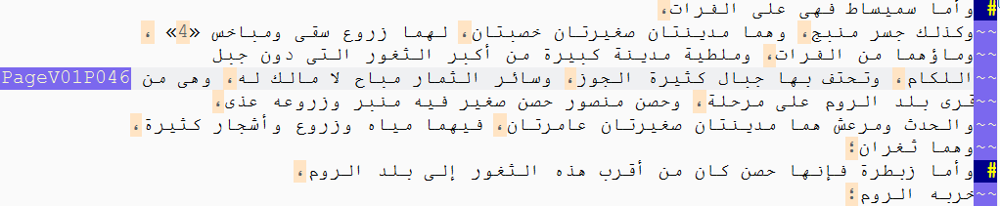
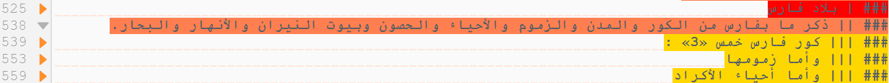
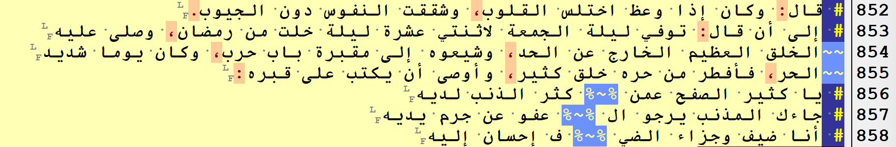
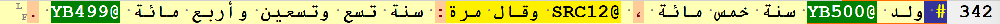
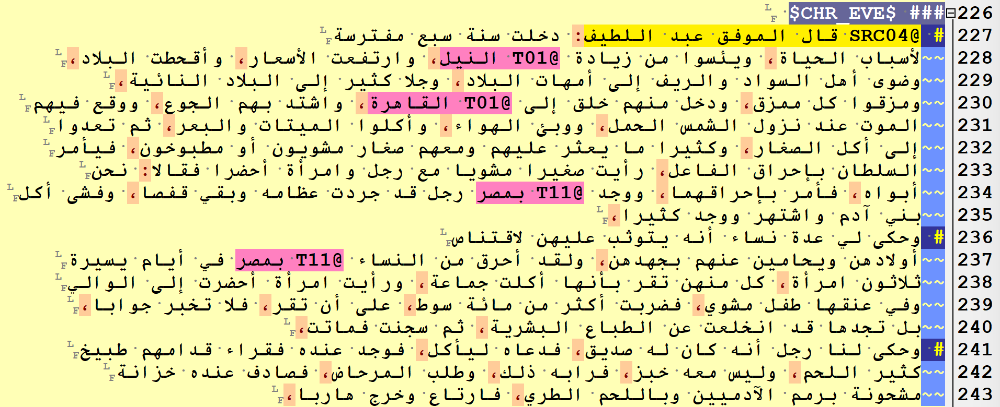

# OpenITI mARkdown

OpenITI mARkdown is a lightweight markup language designed to add basic tagging
in a quick and efficient way to text in right-to-left languages. 

Advantages: 

* no conflicts between LTR tags and RTL text
* no pairs of closing and opening tags as in TEI XML: only single tags
* OpenITI mARkdown tags can be converted to TEI XML
* highlighting and folding schemes available for EditPad Pro and Kate editors. 
* limited but expandable tag set

Full documentation: [alraqmiyyat.github.io/mARkdown/](https://alraqmiyyat.github.io/mARkdown/)

## OpenITI mARkdown header

Each OpenITI mARkdown file has a header that contains three elements: 

1. the so-called **"magic value"** `######OpenITI#`, which activates the OpenITI 
mARkdown highlighting scheme in EditPad Pro. It should be on the first line of 
the file, followed by a line break
2. Zero or more **metadata fields**, each on one line, and each introduced by the tag
`#META#`. This header is meant for metadata salvaged from digital text files, 
and is not necessarily machine-readable. Machine-readable metadata to each text
file is provided in a separate file, in the [YAML](https://en.wikipedia.org/wiki/YAML) 
format; this file has the same filename as the file it describes, and the file 
extension `.yml`.
3. **Header splitter** `#META#Header#End#`: this tag, preceded and followed by an
empty line, splits the metadata header off from the main body of the text.

## Structural text units

### Paragraphs

* `# `: The start of a paragraph in OpenITI texts is tagged with a single hashtag, 
followed by a space. 
* `~~`: because many text editors have trouble displaying very long lines of text,
paragraphs in OpenITI texts are split into short lines (max. 72 characters), each
preceded by two tildes. 

NB: in the near future, OpenITI mARkdown will abandon these tags and will mark 
paragraphs as done in standard `markdown`: double line breaks as paragraph dividers.

### Page numbers: `PageV##P###`

Page numbers in OpenITI mARkdown are formatted in the `PageV##P###` format;
`V##` refers to the volume number,  `P###` to the page number. Both are padded
with zeroes (e.g., `PageV01P001`). 

manuscript transcriptions, add `A` to the page number for recto, and `B` for verso 
(e.g., `PageV01P002B`).

### Section headers: `### | `, `### || `, etc.

Section header tags must always start on a new line and consist of two elements:

1. three hashtags, followed by a space
2. one or more "pipe" symbols (`|`), followed by a space. The number of pipes 
defines the level of a header: one pipe is level 1, two pipes is level 2, etc. 
The highlighting scheme will give each level a different colour. 

If the section has a title, put it on the same line immediately after the final
space of the tag. If the title does not have a section, the rest of the line
after the space may be left blank.

### Dictionary units: `### $`

Lemmata in texts that have a dictionary format (lexicographical dictionaries, 
biographical dictionaries, *ṭabaqāt* works, bibliographical works, etc.) 
can be tagged using the `### $` tag: 

* `### $`: simplified lemma tag: can be used if there is only one type of entry
in a dictionary-type work, or as a temporary tag
* descriptive unit tags: the type of lemma can be expressed by putting it between
two dollar signs: e.g., 
  * dictionary entries:
    - `### $DIC_NIS$` [a descriptive name entry]
    - `### $DIC_TOP$` [a toponym entry]
    - `### $DIC_LEX$` [a lexical entry]
    - `### $DIC_BIB$` [a book title]
  * biographical dictionary entities:
    - `### $BIO_MAN$` [a biography of a man]
    - `### $BIO_WOM$` [a biography of a woman]
    - `### $BIO_REF$` [a cross-reference, for both men and women]
    - `### $BIO_NLI$` [a list of names]
* shorthand unit tags: if a book contains multiple types of lemmata (e.g., 
biographies of men and women; book titles and genre categories), multiple dollar
signs can be used to differentiate between each type. E.g., 
  - `### $` [a biography of a man]
  - `### $$` [a biography of a woman]
  - `### $$$` [a cross-reference and/or repetition, for both men and women]
  - `### $$$$` [a list of names]
  
### Paratext sections: `### |EDITOR|`, `### |PARATEXT|`, `### |APPENDIX|`

These tags are used to mark sections that do not really form part of the text; 
for many kinds of computational analysis, it may be useful to disregard these 
sections: 

* `### |EDITOR|`: title pages and front matter of the printed editions, 
editorial introductions, indices, table of contents, etc.
* `### |PARATEXT|`: scribal additions to the text, riwāyas at the start of a text,
samāʿa statements, ...
* `### |APPENDIX|`: appendices to the text that are closely related to the text, 
e.g., known fragments from lost parts of a text, sections from alternative 
manuscript transmission chains, etc. 

All of these tags are put on their own on a new line of text at the beginning 
of the section. The section continues until the next `###` tag, or the end of 
the text

### Verses of poetry: `# <hemistich_1> %~% <hemistich_2`

NB: make sure each verse starts on its own line. 

## Semantic patterns

### Years: `YY####`, `YB####`, `YD####`, `YA####`

Years mentioned in a text can be tagged by placing one of the following tags 
in front of them (separate them from the text with a space):

* `YB####`: year of birth
* `YD####`: year of death
* `YA####`: age in years
* `YY####`: any other type of year reference

NB: these tags must be preceded and followed by a space. 

### Named entities (toponyms, personal names, ...): `@XXX##`

This category of tags has a special structure: all tags consist of:

1. an ampersand `@`
2. a three-letter code: 
  - `TOP` for toponyms
  - `SOC` for biographical characteristics
  - `PER` for persons
  - `SRC` for sources (book titles, citation statements like *qāla fulān*, ...)
  - `QUR` for Qur\'ān verses
3. a digit that refers to the length of an attached prefix: e.g.,
  - `@TOP01 بغداد`
  - `@TOP11 ببغداد`
  - `@TOP21 وببغداد`
4. one or more digits that refer to the number of tokens of the entity
(The highlighting scheme will highlight this number of tokens after the tag): e.g.,
  - `@TOP12 بمدينة السلام`
  - `@SRC010 قال محمد بن عبد الملك بن علي بن أحمد السندي`

NB: in order to speed up your tagging, you may use variants of these same tags
with a single-letter code: `@T##`, `@S##`, `@P##`, `@Q##`

## Further reading

Full documentation: [alraqmiyyat.github.io/mARkdown/](https://alraqmiyyat.github.io/mARkdown/)