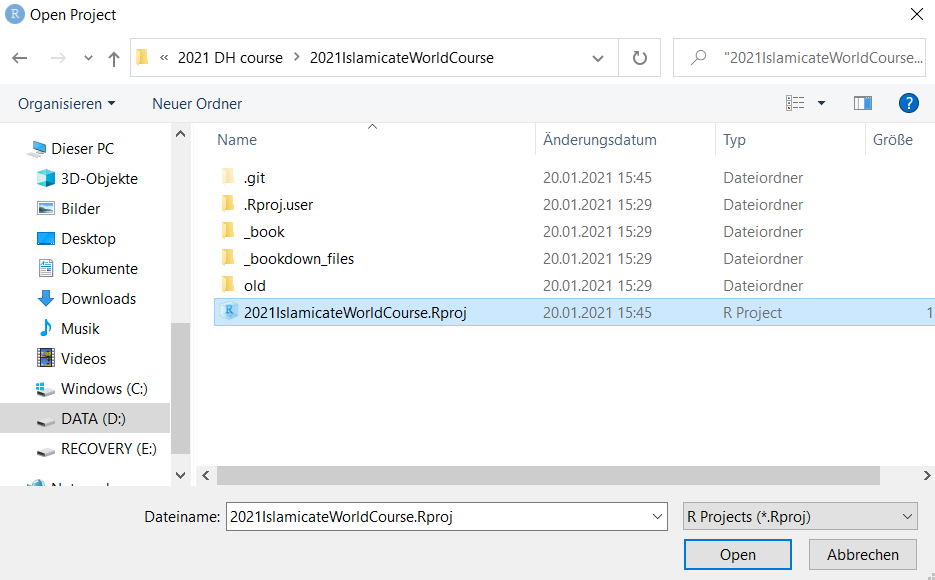
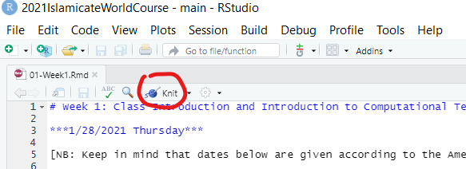
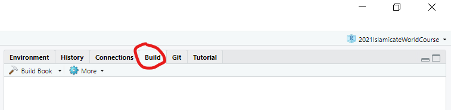
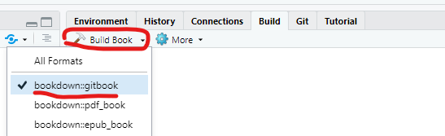

# 2021IslamicateWorldCourse

This is the GitHub repository for the bookdown course website for the 2021 UMD and AKU course *The Islamicate World 2.0: Studying Islamic Cultures through Computational Textual Analysis*.

You can Access the course website here: https://openiti.github.io/2021IslamicateWorldCourse/

## Note for contributors: 

A very short and easy explanation of Bookdown can be found here: https://bookdown.org/home/about/

1. Clone the current repository on your local machine: 

`$ git clone https://github.com/OpenITI/2021IslamicateWorldCourse.git`

2. The course website consists of a number of pages - all files in the root directory of the repository with the extension `.Rmd`: 

```
index.Rmd
01-Week1.Rmd
02-Week2.Rmd
...
14-Week14.Rmd
```

Each of these files can be edited using RStudio

3. in RStudio, go to `File > Open Project`. This will open a file selection dialog; navigate to the repository you cloned, and select the `2021IslamicateWorldCourse.Rproj` in it



4. In the bottom right corner, you will now see the contents of the project folder. Click one of the .Rmd files to edit it. 

5. Edit the file (use Pandoc markdown tags; full overview here: https://pandoc.org/MANUAL.html#pandocs-markdown)

6. When you want to visualize your changes, save (ctrl + s) and then click the "Knit" button in the tab of the document you are editing:



This will create a temporary build of the entire website and open a new window in R in which you can preview your changes. 

7. When you are finished with your work, save your changes (ctrl + s) and click the `Build` tab in the upper right section of RStudio:



8. In the `Build` tab, click the downward arrow next to the `Build Book` button, and choose `bookdown::gitbook`: 



This will build the static html pages from your .Rmd files (they are stored in the `_books` folder in the repository).

9. Save your changes in Git: open Git Bash and use the following commands: 

```
$ git add .
$ git commit -m "Add new course details"
$ git push origin main
```

10. If you want to publish your changes to the public website: push your changes to the `gh-pages` branch, from which the website is served:

`$  git subtree push --prefix _book origin gh-pages`

NB: for an explanation of this command, see https://dev.to/letsbsocial1/deploying-to-gh-pages-with-git-subtree

11. Your changes will be reflected on the live web page (this may take a couple of minutes): https://openiti.github.io/2021IslamicateWorldCourse/
